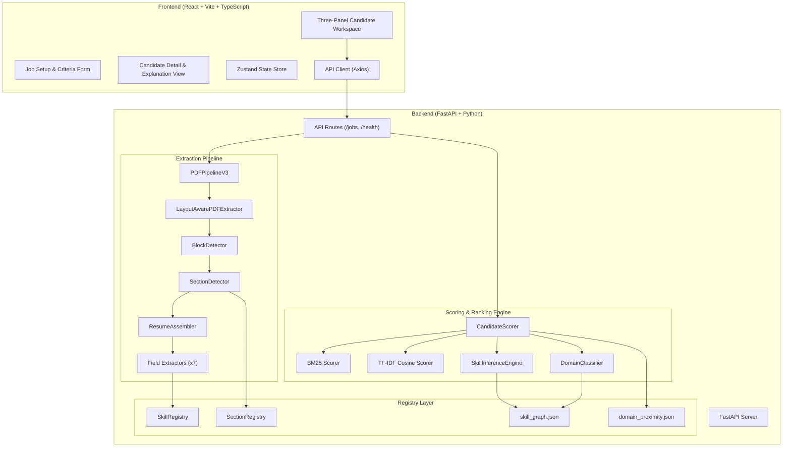

# AI Resume Screening & Candidate Ranking System

[](https://opensource.org/licenses/MIT)
[](https://fastapi.tiangolo.com/)
[](https://react.dev/)
[](https://www.docker.com/)
[](docs/project_report.md)

An end-to-end, enterprise-grade candidate intelligence platform that automates the extraction, semantic analysis, and ranking of resume PDFs against job descriptions (JDs). 

By combining deterministic layouts, custom-compiled regex structures, a graph-based skill inference system, and a multi-signal scoring model (BM25 + Cosine Similarity), the system achieves **97.8% domain classification accuracy** and **1.5% true false-positive rate** on a benchmark of **3,856+ resumes**, without requiring heavy machine learning models or GPU resources.

---

## 🚀 Key Features

*   **Layout-Aware PDF Extraction**: Utilizes `PyMuPDF` to analyze document geometry, detect single/multi-column layouts, identify section headers across 200+ aliases, and parse nested lists.
*   **Dual-Path Arbitration ("Run Both, Score Both, Pick Best")**: Executes both section-based assembly and standalone regex-based parsing in parallel, arbitrating the final output via quality metrics to ensure maximum accuracy across diverse layouts.
*   **Graph-Based Skill Inference**: Resolves skill mismatches (e.g., candidate has "Next.js", JD requires "React") using a customizable graph of 200+ skill nodes covering alias, implication, and related relations.
*   **13-Domain Professional Classification**: Classifies candidates and JDs into 13 major career sectors (Engineering, Healthcare, Legal, etc.) and 10 engineering subdomains (Software, Civil, ML, DevOps, etc.) using weighted keyword dictionaries.
*   **Multi-Signal Ranking Engine**: Computes scores based on:
    *   **BM25 Skill Matching** (IDF computed dynamically over the candidate pool).
    *   **TF-IDF Cosine Similarity** for job titles and field of study matching.
    *   **Experience Parameters** (total years, title similarity, recency).
    *   **Education Levels** (PhD, Master's, Bachelor's, Associate's).
    *   **Prestige & Certification Bonuses** (FAANG, consulting, hackathons).
*   **Explainable by Design**: Every candidate profile displays a complete breakdown of matched/missing skills, experience metrics, knockout reasons, and anomalies (gaps, low quality, overqualification) in a clean 3-panel UI.

---

## 📐 System Architecture

The application is built as a decoupled two-tier architecture communicating via REST APIs and Server-Sent Events (SSE) for real-time extraction progress:



---

## 🛠️ Technology Stack

| Layer | Technologies | Purpose |
| :--- | :--- | :--- |
| **Frontend** | React (v18), TypeScript, Vite, TailwindCSS, Zustand, shadcn/ui | Interactive Recruiter Workspace, 3-panel layout, visual score breakdown. |
| **Backend** | Python 3.11, FastAPI, Uvicorn, PyMuPDF (fitz) | High-concurrency REST endpoints, layout parsing, scoring computations. |
| **Algorithms** | TF-IDF, BM25, Cosine Similarity, Graph Traversals | Dynamic candidate-JD matching, text similarity, skill inferences. |
| **Registries** | JSON Schema (Graph & Proximity Data) | Fully externalized rules for domain boundaries and skill connections. |
| **DevOps & Cloud** | Docker, AWS Lambda, API Gateway, DynamoDB, S3 | Serverless cloud deployment, horizontally scalable execution. |

---

## ⚙️ Installation & Local Development

### Prerequisites

*   Python 3.10 or 3.11
*   Node.js 18+ & npm
*   Docker (Optional, for containerized run)

### 1. Backend Setup

Navigate to the `backend` directory, set up a virtual environment, and install dependencies:

```bash
cd backend
python -m venv .venv
# On Windows
.venv\Scripts\activate
# On macOS/Linux
source .venv/bin/activate

# Install dependencies using uv or pip
pip install -r pyproject.toml
# Or if pyproject.toml isn't directly supported by your pip version:
pip install fastapi uvicorn PyMuPDF pydantic jinja2 python-multipart pytest
```

Configure environment variables (copy `.env.example` to `.env`):

```bash
cp .env.example .env
```

Start the FastAPI backend server:

```bash
uvicorn main:app --reload --port 8000
```
The API documentation will be available at `http://localhost:8000/docs`.

### 2. Frontend Setup

Navigate to the `frontend` directory, install dependencies, and start the Vite dev server:

```bash
cd ../frontend
npm install
npm run dev
```
Open `http://localhost:5173` in your browser to access the workspace.

---

## 🐳 Docker Setup

Run the entire platform locally using Docker Compose:

```bash
# From the project root directory
docker-compose up --build
```

This starts:
*   The backend at `http://localhost:8000`
*   The frontend at `http://localhost:3000` (or the configured port)

---

## ☁️ AWS Deployment

The system is designed to be fully deployable as a serverless stack:

1.  **FastAPI Backend**: Packaged as a Docker container using `Dockerfile` and hosted on AWS Lambda via ECR (Elastic Container Registry) and API Gateway.
2.  **Storage**: Resumes uploaded are written to AWS S3.
3.  **Database**: Job descriptions and scored metadata are stored in Amazon DynamoDB.
4.  **Monitoring**: CloudWatch tracks execution logs and extraction times.

Refer to the deployment guide in the [Project Report](docs/project_report.md#7-deployment) for full CloudFormation/Terraform setups.

---

## 📊 Benchmark Results (V9 Production Ready)

Tested against the V4 benchmark corpus consisting of **3,856 real resumes** graded against **20 job descriptions** across 13 domains:

*   **Overall Quality Score**: `86/100` (🔵 Production Ready)
*   **Domain Classification Accuracy**: `97.8%`
*   **True False Positive (FP) Rate**: `1.5%` (Cross-domain candidates successfully filtered)
*   **Knockout Reliability**: `100%` (Correctly disqualified mismatched candidates)
*   **Extraction Quality**: `72/100` (Highly structured data captured across varying font sizes and layouts)

---

## 📄 License

This project is licensed under the MIT License. See [LICENSE](LICENSE) for details.
