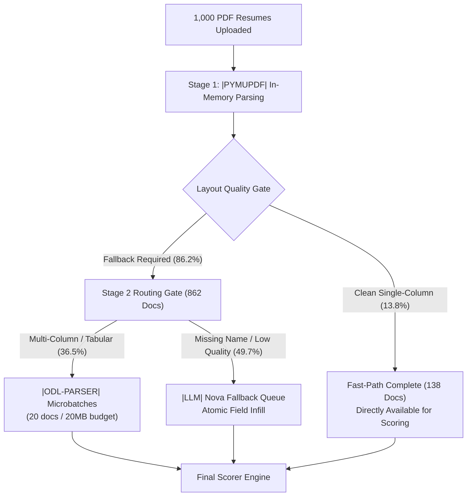

# SWYRA Sortlist — Explainable Candidate Review Workspace (v2 Release)

[](LICENSE)
[](https://fastapi.tiangolo.com/)
[](https://react.dev/)
[](https://www.typescriptlang.org/)
[](docs/v2-release/PRODUCT.md)

> **Core Promise:** Every recommendation is evidence-linked, configurable, reviewable, and reversible by a human recruiter.

SWYRA Sortlist is **NOT** an autonomous hiring system and **NOT** a generic enterprise ATS. It is a focused, explainable candidate-review workspace built for small hiring teams (2–15 recruiters) and boutique agencies who need transparent, audit-ready screening assistance.

---

## 📚 Authoritative Release Specifications

All architectural, product, scoring, and safety decisions for the v2 public release are documented in the authoritative specifications under [`docs/v2-release/`](docs/v2-release/):

| Specification | Description |
| :--- | :--- |
| [**AUDIT.md**](docs/v2-release/AUDIT.md) | Full technical audit of implemented vs. planned behavior, tech debt, and security findings. |
| [**PRODUCT.md**](docs/v2-release/PRODUCT.md) | Product identity, target users, decision workflows, core capabilities, and scope boundaries. |
| [**ARCHITECTURE.md**](docs/v2-release/ARCHITECTURE.md) | Modular monolith architecture, data flow, DynamoDB/S3 layouts, and provider interfaces. |
| [**DATA-MODEL.md**](docs/v2-release/DATA-MODEL.md) | DynamoDB single-table schema, S3 key patterns, entity lifecycles, and TypeScript contracts. |
| [**API-CONTRACTS.md**](docs/v2-release/API-CONTRACTS.md) | Complete REST API reference, request/response DTOs, rate limits, and authentication. |
| [**SCORING-POLICY.md**](docs/v2-release/SCORING-POLICY.md) | Binding scoring mathematics, allowed vs. prohibited inputs, knockout rules, and factor ledger. |
| [**TRUST-SAFETY-PRIVACY.md**](docs/v2-release/TRUST-SAFETY-PRIVACY.md) | Non-negotiable fairness policy, data retention, audit logging, and ATS checker privacy. |
| [**EVALUATION.md**](docs/v2-release/EVALUATION.md) | Evaluation methodology, gold-set validation, benchmark protocol, and audit of legacy claims. |
| [**IMPLEMENTATION-PLAN.md**](docs/v2-release/IMPLEMENTATION-PLAN.md) | Phased delivery plan across P0 Security, P1 Evidence Workflow, and P2 ATS Diagnostics. |
| [**ACCEPTANCE-TESTS.md**](docs/v2-release/ACCEPTANCE-TESTS.md) | Acceptance test suites, test IDs, verification criteria, and quality gates. |
| [**MIGRATION.md**](docs/v2-release/MIGRATION.md) | Migration guide from v1 prototype to v2 public release. |

> [!NOTE]
> All root legacy documentation files (`projectrequirement.md`, `project.md`, `architecture.md`, `design.md`, `rules.md`, `phases.md`, etc.) are superseded by the specifications in `docs/v2-release/`.

---

## ⚖️ Non-Negotiable Fairness Policy

Sortlist is built on strict algorithmic transparency and fairness:

1. **Prohibited Ranking Inputs:** The system **never** uses, infers, ranks, filters, or exposes as a recommendation factor:
   - Age, date of birth, gender, race, caste, religion, nationality, disability, marital status, photo, or address beyond city level.
   - Name-based or location-based demographic proxies.
   - **University prestige** (degrees are evaluated by accredited educational level, not institutional elitism).
   - **Employer prestige** (all past employers are evaluated equally; FAANG/Fortune 500 bonuses are disabled).
   - **Career gaps** (employment gaps are not scored or penalized).
   - Inferred "culture fit" or subjective traits.
2. **Separation of Concerns:** System recommendations (`SCORED`, `REVIEW_REQUIRED`, `ABSTAIN`) and Human Decisions (`NEW`, `REVIEWING`, `SHORTLISTED`, `REJECTED`, `INTERVIEW`, `ARCHIVED`) are stored as strictly separate fields. The system cannot auto-reject candidates.
3. **Mandatory Rejection Rationale:** Recruiters documenting a candidate rejection must provide an evidence-based rationale, ensuring human accountability.

---

## 🔬 Note on Legacy Metrics (Truthful Reporting)

Previous prototype documents cited unvalidated claims, including a "97.8% domain classification accuracy" and an "86/100 production readiness score" on 3,856 resumes. **These metrics are unvalidated prototype claims** and are superseded by the empirical gold-set evaluation methodology detailed in [docs/v2-release/EVALUATION.md](docs/v2-release/EVALUATION.md).

---

## 🚀 Core Capabilities

- **Versioned Job Criteria:** Define criteria with explicit weights (Skills, Experience, Keywords, Education) and tracked `job_version` lineage.
- **Asynchronous PDF Extraction:** Dual-pass PyMuPDF parser with reading-order layout clustering and optional ODL fallback.
- **Graph-Based Skill Inference:** Transparent inference engine supporting direct, alias, implication, and related skills with explicit confidence weighting.
- **Evidence-First Inspector:** Clickable provenance linking candidate scores to verified resume sections and page regions.
- **B2B ATS Health Diagnostic:** Ephemeral, candidate-facing parseability check with layout risk overlays and transparent limitations disclaimer.
- **Security & Multi-Tenancy:** Multi-tenant organization scoping, signed session tokens (httpOnly cookies), rate limiting, security headers, and cascading deletion endpoints.

---

## ⚡ Architecture Power & Empirical Benchmark (1,000 Resumes)

Empirical benchmark conducted on **1,000 real-world PDF resumes** sampled from the 3,850-resume corpus (`data/resumes/`) on a 16-core workstation running on `127.0.0.1:8000`. Raw data and full JSON results are tracked in [`backend/benchmark_1k_results.json`](backend/benchmark_1k_results.json).

### 1. Latency & Throughput Benchmark (1,000 Resumes)

| Metric | Measured Value | Operational Significance |
| :--- | :--- | :--- |
| **Evaluated Corpus** | **1,000 Resumes** | 2,729 total pages (avg **2.73 pages/resume**), avg **118.5 KB/file** |
| **Total Wall-Clock Time** | **292.75 seconds** (~4.88 min) | Complete end-to-end stage 1 parsing across 16 worker threads |
| **Effective Throughput** | **3.42 resumes / second** | **~205 resumes / minute** sustained extraction rate |
| **Mean Latency per Doc** | **4,659.03 ms** | Per-thread turnaround under 16-worker thread saturation |
| **Median (P50) Latency** | **3,909.08 ms** | Standard single/dual-page resume processing time |
| **P90 Latency** | **8,761.19 ms** | 3–4 page dense structured resumes |
| **P95 Latency** | **10,246.24 ms** | Heavy multi-column documents |
| **P99 Latency** | **15,657.46 ms** | Long-form multi-page CVs (5+ pages) |
| **Min / Max Latency** | **232.56 ms / 42.43 s** | From ultra-fast 1-pagers to complex scanned documents |
| **Standard Deviation** | **3,436.27 ms** | Distribution driven by visual block density and page count |

### 2. Field Extraction Coverage & Quality Gate

Deterministic extraction evaluated across all 1,000 resumes with strict identity validation to eliminate noisy extractions:

| Extracted Field | Extracted Count | Coverage Rate | Details |
| :--- | :---: | :---: | :--- |
| **Skills** | **969 / 1,000** | **96.9%** | Average **9.3 verified skills** per resume |
| **Experience** | **843 / 1,000** | **84.3%** | Average **2.6 past roles** per resume (titles, companies, dates) |
| **Education** | **590 / 1,000** | **59.0%** | Average **1.7 degrees/programs** per resume |
| **Email Address** | **723 / 1,000** | **72.3%** | Validated email regex matching |
| **Phone Number** | **763 / 1,000** | **76.3%** | E.164 and international phone patterns |
| **Location** | **577 / 1,000** | **57.7%** | City, state, or country detected |
| **Human Name** | **548 / 1,000** | **54.8%** | Passes strict identity resolution (45.2% safely gated for fallback) |

> [!TIP]
> **Candidate Name Guardrails**: Rather than guessing names from job titles (`Staff Pharmacist`), addresses (`Ooty Road`), hobbies (`Passion`), or placeholders (`Candidate`), Sortlist strictly validates candidate names. Resumes with unverified identity headers are gated for Stage 2 ODL / Nova LLM fallback to preserve data integrity and prevent hallucinated records.

### 3. Tiered Pipeline Routing & Fallback Gating


```mermaid
flowchart TD
    A["1,000 PDF Resumes Uploaded"] --> B["Stage 1: |PYMUPDF| In-Memory Parsing"]
    B --> C{"Layout Quality Gate"}
    C -->|"Clean Single-Column (13.8%)"| D["Fast-Path Complete (138 Docs)<br/>Directly Available for Scoring"]
    C -->|"Fallback Required (86.2%)"| E["Stage 2 Routing Gate (862 Docs)"]
    E -->|"Multi-Column / Tabular (36.5%)"| F["|ODL-PARSER| Microbatches<br/>(20 docs / 20MB budget)"]
    E -->|"Missing Name / Low Quality (49.7%)"| G["|LLM| Nova Fallback Queue<br/>Atomic Field Infill"]
    F --> H["Final Scorer Engine"]
    G --> H
    D --> H
```

- **Clean Fast-Path (`S2_DONE`): 13.8% (138 / 1,000)** — Handled instantly in-memory by `|PYMUPDF|` with clean single-column layouts and zero cloud/LLM costs.
- **Microbatched ODL Fallback (`|ODL-PARSER|`): 36.5% (365 / 1,000)** — Multi-column, table-heavy, or non-linear reading orders routed in bounded batches (max 20 docs / 20MB budget) to the JVM layout parser.
- **Targeted LLM Infill (`|LLM|`): 49.7%** — Atomic field infill (Bedrock Nova) invoked only for missing critical fields rather than entire documents.

### 4. Ranking Scorer Throughput (1,000 Candidates)

| Metric | Measured Value |
| :--- | :--- |
| **Candidates Scored** | **1,000 candidates** |
| **Total Scoring Wall-Clock** | **11.37 seconds (11,374 ms)** |
| **Per-Candidate Scoring Latency** | **11.37 ms / candidate** |
| **Scoring Throughput** | **88 candidates / second** |
| **Algorithmic Engine** | Single-pass pre-computed BM25 IDF ($O(N)$), TF-IDF role title cosine similarity, and zero prohibited attributes |

---

## 🛠️ Quick Start

### Prerequisites
- Python 3.13+
- Node.js 18+ and npm
- AWS LocalStack or AWS credentials (S3 & DynamoDB)

### 1. Backend Setup
```bash
cd backend
python -m venv .venv
source .venv/bin/activate

# Install dependencies
pip install -e .

# Configure environment variables
cp ../.env.example ../.env

# Start development server
uvicorn src.main:app --host 0.0.0.0 --port 8000 --reload
```

### 2. Frontend Setup
```bash
cd frontend
npm install
npm run dev
```
Open `http://localhost:5173` to access the workspace.

### 3. Running Tests
```bash
cd backend
PYTHONPATH=. pytest tests/
```

---

## 📄 License
This project is licensed under the MIT License. See [LICENSE](LICENSE) for details.
