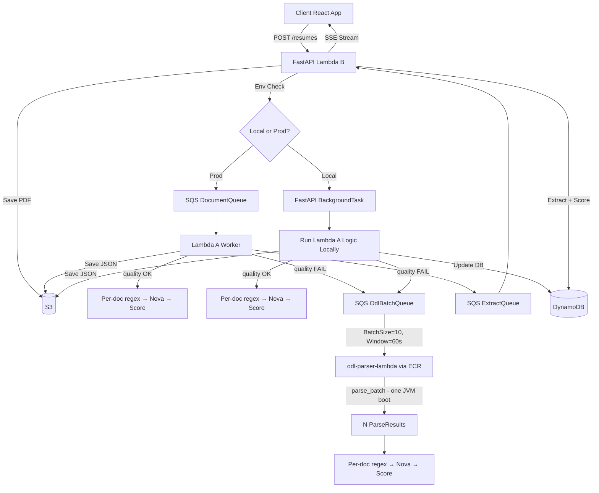

# architecture.md — Resume Ranker V2
> System architecture, tech stack, and data flow. Rev 4 — Local-First, 2-Lambda Prod, Tiered Extraction.

## 1. Architecture Overview

The system decouples heavy JVM-based PDF parsing from fast Python-based evaluation to optimize performance and bypass AWS Lambda deployment limits. 

Crucially, the architecture supports a **Local-First Development** model. The local development environment uses FastAPI `BackgroundTasks` to simulate the async Lambda A pipeline, ensuring developers can run the entire system locally without AWS SQS or Lambda A infrastructure.

## 2. Tech Stack

- **Frontend:** React 18, Vite, Zustand (state), TanStack Query (fetching only).
- **Local Dev (Local-Cloud Split):** FastAPI `BackgroundTasks` (simulates Lambda A synchronously). S3 and DynamoDB point to floci (`localhost:4566`). Bedrock calls hit real AWS. ODL parser uses Local Bypass: imports `odl/main.py` directly via `lambda_handler(event, None)` instead of invoking the cloud Lambda. Same event payload shape both ways: `{"s3_bucket": ..., "s3_key": ...}`.
- **Prod Worker (Lambda A):** Python 3.12 ZIP. PyMuPDF, `boto3` (for enqueueing to OdlBatchQueue and invoking ODL).
- **ODL Batch Queue (`OdlBatchQueue`):** SQS FIFO queue. Documents that fail the quality gate are enqueued here. Native SQS batch trigger (`BatchSize=10, MaximumBatchingWindowInSeconds=60`) flushes groups to `odl-parser-lambda` in one invoke.
- **Standalone ODL Parser:** `odl-parser-lambda` deployed as a Docker container via ECR. Receives `{"documents": [...]}` (batch API, ADR-10).
- **Prod API (Lambda B):** Python 3.12 ZIP. FastAPI, `boto3`, `scikit-learn`, `rank_bm25`.
- **Database:** DynamoDB (with purpose-built GSIs for filtering, see `design.md`).

## 2b. ODL Batching — JVM Amortisation

Every `odl-parser-lambda` invocation pays a **~0.74s JVM cold-start cost** regardless of how many PDFs are in the payload. The old per-document routing paid this cost N times for N quality-failed documents. The new routing amortises one JVM boot across up to 10 documents per SQS window flush:

| Approach | 10 ODL-destined docs | JVM boots | Approx. savings |
|----------|---------------------|-----------|----------------|
| Serial (old) | 10 × `parse()` | 10 | — |
| Batch (new) | 1 × `parse_batch()` | 1 | ~0.74s × 9 = **6.7s** |

**Why Nova stays per-document:** Nova calls hit Bedrock (no JVM, no cold start). Each call costs fractions of a cent and completes in ~200-500ms. Batching Nova calls would add a `MaximumBatchingWindowInSeconds` latency floor for users on low-traffic periods with no benefit — the bottleneck was always JVM boot, which Bedrock doesn't have.

## 3. The "Big Picture" Data Flow

### Step 1: Receive Resume (API Gateway / Lambda B)
1. Client calls `POST /api/v2/jobs/{id}/resumes`.
2. API calculates SHA-256. Checks DynamoDB for duplicates.
3. API uploads PDF to S3.
4. API creates a DynamoDB item: `PK: JOB#{job_id}, SK: CAND#{doc_id}, status: PENDING`.
5. **Routing:** If `ENVIRONMENT == 'local'`, API schedules the parsing function via `BackgroundTasks`. If `ENVIRONMENT == 'production'`, API pushes `{"doc_id": "..."}` to SQS `DocumentQueue`.
6. API returns `202 Accepted` immediately.

### Step 2: Read Resume (Lambda A / BackgroundTask)
1. Worker downloads PDF from S3.
2. **Fast-Path (PyMuPDF):** Extract text using `fitz`.
3. **Pre-Extraction Quality Gate:** Calculate a structural heuristic quality score (x-coordinate clustering, reading order monotonicity, char density). This runs *before* regex parsing.
4. **Slow-Path (ODL):** If structural quality score < 0.90, run `opendataloader-pdf` (JVM) using Local Bypass (import `odl/main.py`) in local dev, or `boto3.client('lambda').invoke()` in prod. This resolves multi-column layouts and provides bounding boxes (`bbox`). Same event payload shape both ways: `{"s3_bucket": ..., "s3_key": ...}`.
5. Worker saves `StructuralParse` JSON to S3.
6. Worker updates DynamoDB: `status: PARSED`.
7. **Routing:** If local, worker directly calls the Evaluation function. If prod, worker pushes to `ExtractionQueue`.

### Step 3: Understand Resume (Lambda B / SQS Consumer)
1. Lambda B reads `StructuralParse` JSON from S3.
2. Runs V1 ported regex parsers on the clean Markdown.
3. Collects `UnresolvedChunk`s.
4. **LLM Fallback:** If unresolved chunks exist, batch them and call Amazon Bedrock (Nova Micro) with `temperature=0` and `toolConfig`.

### Step 4: Score Resume (Lambda B)
1. Runs `ScoringService` (BM25 with fixed `idf.pkl`).
2. Runs `AtsScoringService` (100% deterministic bbox math) in parallel.
3. Saves `ScoringResult` to S3.
4. Updates DynamoDB: `status: SCORED`, `composite_score: <float>`.

### Step 5: Show Result (SSE)
1. The `GET /api/v2/jobs/{id}/extract` SSE endpoint is held open by the frontend.
2. Lambda B polls DynamoDB every 1-2 seconds for document state transitions.
3. When a document transitions to `SCORED` or `FAILED`, Lambda B emits an SSE event.
4. When all documents are `SCORED`, it emits `processing_complete` and closes the stream.
5. Frontend receives `complete`, fetches the scored candidates, and pushes them into Zustand.

## 4. DynamoDB Strategy (Avoiding Table Scans)

To support V2 filtering requirements (score range, skill presence, status) without expensive `scan()` operations, DynamoDB uses specific GSIs (Global Secondary Indexes). The exact schema is defined in `design.md`, but the architectural rule is: **Multi-attribute filtering MUST use GSIs, never `FilterExpression` on a base table scan.**

- **GSI1 (Score Range):** Buckets scores (e.g., `floor(score/10)`) to allow efficient `BETWEEN` style queries.
- **GSI2 (Skill Presence):** Sparse index mapping candidates to specific skills.
- **GSI3 (Status):** Indexes candidate status (shortlisted, rejected) for pipeline views.

## 5. Instrumentation & Telemetry

To validate the PyMuPDF→ODL→Nova routing decision empirically, every extraction stage MUST emit a `StageTiming` record. This data is persisted alongside the extraction result and aggregated into benchmark reports.

- Tracks which path each resume took (PyMuPDF-only, PyMuPDF→ODL, PyMuPDF→ODL→Nova).
- Measures `duration_ms` per stage.
- Records the `quality_score` that triggered the ODL fallback.
- This is the only way to detect if the quality gate threshold is mis-tuned (e.g., routing 60% of resumes to the JVM instead of the expected ~10%).

## 6. SSE Configuration on AWS Lambda

Standard API Gateway REST API integration has a 29-second hard timeout. SSE streams processing >5 resumes will fail. 
**Resolution:** The `/extract` endpoint MUST be exposed via **AWS Lambda Function URLs** configured with `RESPONSE_STREAM` invoke mode, or via API Gateway HTTP API (which supports streaming). The FastAPI handler must use `StreamingResponse` with async generators to yield SSE events continuously without holding the Lambda execution thread.

## 6b. SSE Stream Lifetime vs Lambda B's 15-Minute Execution Ceiling

RESPONSE_STREAM invoke mode solves the API Gateway 29-second timeout but does NOT extend Lambda's own maximum execution duration (15 minutes, hard AWS limit, cannot be configured higher). If a batch's total processing time (including any ODL-Lambda synchronous calls per ADR-09) exceeds 15 minutes, the Lambda B instance holding the SSE connection is terminated mid-stream by AWS, regardless of documents still PENDING.

Required behavior:
  - Frontend's EventSource onerror/reconnect handler MUST detect a dropped SSE connection and re-open GET /api/v2/jobs/{id}/extract. A fresh Lambda B invocation resumes polling DynamoDB from current state — it does NOT restart already-PARSED or already-SCORED documents (idempotency per R-14).
  - This reconnect-and-resume behavior MUST be implemented in Phase 2 (SSE polling), not deferred to Phase 4, since it's a correctness property of the polling design, not an infrastructure concern.