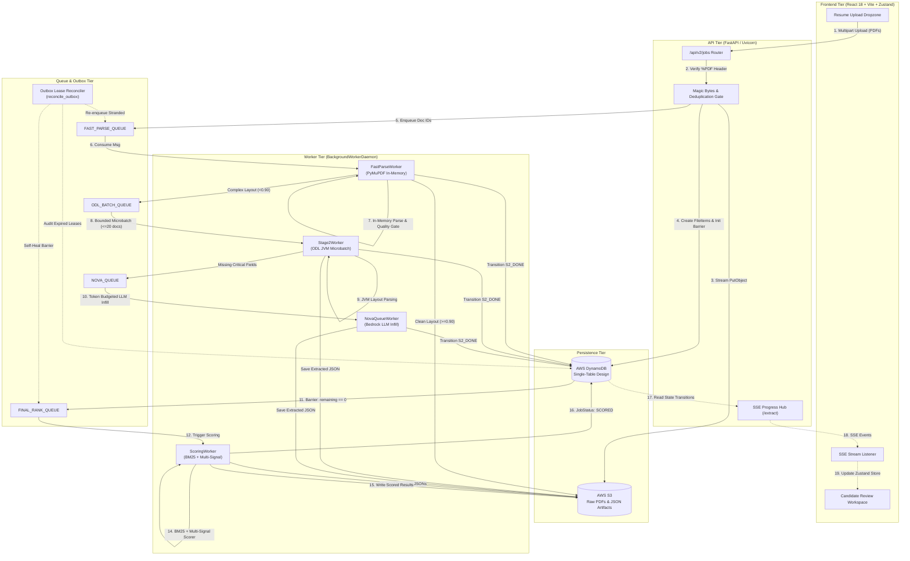
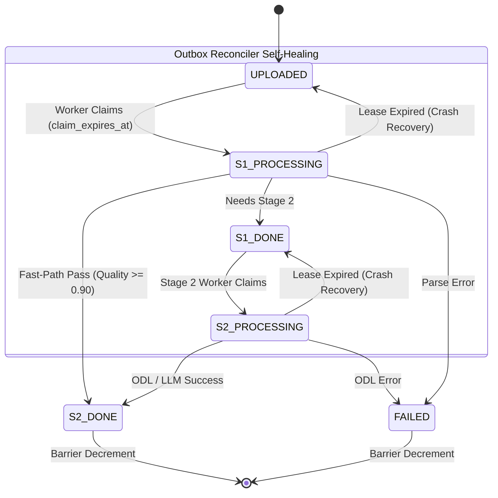

# architecture.md — SWYRA Sortlist V2.2
> System Architecture, Module Topology, and Pipeline Data Flow.
> Rev 5 — Modular Monolith, Durable Worker Pipeline & S3 Upload Proxy.

---

## 1. Architectural Philosophy

SWYRA Sortlist is architected as a **modular monolith**: a single deployable unit per tier that achieves enterprise-grade durability, high throughput, and complete auditability without the operational overhead of microservices or distributed Kubernetes clusters.

### Core Principles
1. **Frontend -> Backend -> S3 Upload Proxy:** The browser never uploads directly to AWS S3. All files pass through FastAPI (`POST /api/v2/jobs/{job_id}/resumes`), which performs magic bytes (`%PDF`) validation, computes SHA-256 deduplication, writes to S3, updates DynamoDB, and dispatches parsing. S3 CORS is unnecessary, enabling sub-50ms server startup.
2. **Durable Multi-Stage Work Queues:** Extraction is separated into four distinct stages (`FAST_PARSE`, `ODL_BATCH`, `NOVA_FALLBACK`, `FINAL_RANK`). Each stage communicates via decoupled queues (SQS in production, in-memory queues in local development).
3. **Outbox Pattern with Worker Lease Recovery:** Worker tasks claim items with a lease timestamp (`claim_expires_at`). If a worker crashes or is abruptly killed, `reconcile_outbox()` identifies expired leases and re-enqueues stranded files.
4. **Barrier Synchronization with Self-Healing:** The final scoring engine is triggered only when all files reach terminal states (`remaining == 0`). If an unexpected crash desynchronizes the barrier count, the reconciler automatically self-heals the counter and dispatches ranking.
5. **Deterministic, Explainable Scoring:** Zero LLMs in the ranking hot-path. Scoring is 100% deterministic using precomputed BM25 IDF, TF-IDF role matching, and evidence-linked factor ledgers.

---

## 2. System Architecture Diagram


```mermaid
flowchart TD
    subgraph ClientTier ["Frontend Tier (React 18 + Vite + Zustand)"]
        UI["Candidate Review Workspace"]
        Upload["Resume Upload Dropzone"]
        SSEListener["SSE Stream Listener"]
    end

    subgraph APITier ["API Tier (FastAPI / Uvicorn)"]
        Router["/api/v2/jobs Router"]
        MagicValidator["Magic Bytes & Deduplication Gate"]
        SSEHub["SSE Progress Hub (/extract)"]
    end

    subgraph StorageTier ["Persistence Tier"]
        S3[("AWS S3<br/>Raw PDFs & JSON Artifacts")]
        DDB[("AWS DynamoDB<br/>Single-Table Design")]
    end

    subgraph QueueTier ["Queue & Outbox Tier"]
        Q1["FAST_PARSE_QUEUE"]
        Q2["ODL_BATCH_QUEUE"]
        Q3["NOVA_QUEUE"]
        Q4["FINAL_RANK_QUEUE"]
        Reconciler["Outbox Lease Reconciler<br/>(reconcile_outbox)"]
    end

    subgraph WorkerTier ["Worker Tier (BackgroundWorkerDaemon)"]
        W1["FastParseWorker<br/>(PyMuPDF In-Memory)"]
        W2["Stage2Worker<br/>(ODL JVM Microbatch)"]
        W3["NovaQueueWorker<br/>(Bedrock LLM Infill)"]
        W4["ScoringWorker<br/>(BM25 + Multi-Signal)"]
    end

    %% Upload Flow
    Upload -->|"1. Multipart Upload (PDFs)"| Router
    Router -->|"2. Verify %PDF Header"| MagicValidator
    MagicValidator -->|"3. Stream PutObject"| S3
    MagicValidator -->|"4. Create FileItems & Init Barrier"| DDB
    MagicValidator -->|"5. Enqueue Doc IDs"| Q1

    %% Stage 1 Fast Parse
    Q1 -->|"6. Consume Msg"| W1
    W1 -->|"7. In-Memory Parse & Quality Gate"| W1
    W1 -->|"Clean Layout (>=0.90)"| S3
    W1 -->|"Transition S2_DONE"| DDB
    W1 -->|"Complex Layout (<0.90)"| Q2

    %% Stage 2 ODL Microbatch
    Q2 -->|"8. Bounded Microbatch (<=20 docs)"| W2
    W2 -->|"9. JVM Layout Parsing"| W2
    W2 -->|"Save Extracted JSON"| S3
    W2 -->|"Transition S2_DONE"| DDB
    W2 -->|"Missing Critical Fields"| Q3

    %% Stage 3 Nova Fallback
    Q3 -->|"10. Token Budgeted LLM Infill"| W3
    W3 -->|"Save Extracted JSON"| S3
    W3 -->|"Transition S2_DONE"| DDB

    %% Barrier & Scoring
    DDB -->|"11. Barrier: remaining == 0"| Q4
    Q4 -->|"12. Trigger Scoring"| W4
    W4 -->|"13. Load Extracted JSONs"| S3
    W4 -->|"14. BM25 + Multi-Signal Scorer"| W4
    W4 -->|"15. Write Scored Results"| S3
    W4 -->|"16. JobStatus: SCORED"| DDB

    %% Live Feedback
    DDB -.->|"17. Read State Transitions"| SSEHub
    SSEHub -.->|"18. SSE Events"| SSEListener
    SSEListener -.->|"19. Update Zustand Store"| UI

    %% Self Healing
    Reconciler -.->|"Audit Expired Leases"| DDB
    Reconciler -.->|"Re-enqueue Stranded"| Q1
    Reconciler -.->|"Self-Heal Barrier"| Q4
```

---

## 3. Tech Stack & Infrastructure Specifications

| Component | Technology | Rationale |
| :--- | :--- | :--- |
| **Frontend** | React 18, TypeScript, Vite, Tailwind CSS, shadcn/ui, Lucide Icons | Type-safe, brutalist recruiter UI; zero unnecessary bundle bloat. |
| **Frontend State** | Zustand | Atomic state stores (`job-store`, `candidate-store`, `app-store`) with memoized selectors to avoid re-render loops. |
| **Backend API** | Python 3.13, FastAPI, Uvicorn | Async ASGI server, native type validation, auto-generated OpenAPI specs. |
| **Object Storage** | AWS S3 (`resume-ranker-documents-local`) | Scalable storage for raw PDF resumes, structured extraction JSONs, and scoring snapshots. |
| **Database** | AWS DynamoDB (Single-Table, `PAY_PER_REQUEST`) | Sub-10ms key-value lookups with composite PK/SK patterns and optimistic concurrency locking. |
| **Fast Extraction** | PyMuPDF (`fitz`) | High-speed C-based text extraction with visual reading order reconstruction. |
| **Layout Extraction** | OpenDataLoader PDF (JVM / Docker) | Amortized microbatch parser for multi-column resumes, tables, and bounding boxes. |
| **LLM Infill** | Amazon Bedrock (Nova Micro) | Strictly bounded to fill unresolved chunks/names with temperature=0 and atomic token budgets. |
| **Scoring Engine** | Python (`rank_bm25`, `scikit-learn`, `numpy`) | 100% deterministic scoring with precomputed reference IDF table and explainable factor ledgers. |

---

## 4. End-to-End Pipeline Workflow

### Stage 1: Document Ingestion & Fast-Path Parsing
1. **Multipart Upload:** Recruiter submits resumes via `POST /api/v2/jobs/{job_id}/resumes`.
2. **Magic Bytes Gate:** FastAPI reads the initial bytes of each stream; non-`%PDF` files are rejected upfront with descriptive error structures.
3. **S3 Stream & Barrier Registration:** Valid files are streamed directly to S3 under `jobs/{job_id}/raw/{file_id}.pdf`. File records are created in DynamoDB with `status = UPLOADED`, and the job's atomic barrier counter (`remaining += N`) is incremented.
4. **Fast-Parse Queue:** Messages are enqueued to `FAST_PARSE_QUEUE`.
5. **PyMuPDF Extraction:** `FastParseWorker` downloads the PDF from S3 into memory, runs structural heuristic layout evaluation (x-clustering, reading order monotonicity, character density), and extracts candidate sections.
6. **Fast-Path Completion:** If layout quality $\ge 0.90$ and required fields are parsed, the worker uploads the structured JSON to S3, transitions the file to `S2_DONE`, and decrements the job barrier.

### Stage 2: Bounded ODL JVM Microbatching
1. **Routing Gate:** If structural quality $< 0.90$ (multi-column layouts, tabular formatting, or irregular text blocks), the file is enqueued to `ODL_BATCH_QUEUE`.
2. **Microbatch Aggregation:** `Stage2Worker` pulls up to 20 documents (max 20MB budget) to amortize JVM initialization.
3. **Execution & Cleanup:** ODL parses visual layout elements and bounding boxes. Upon completion, files are updated to `S2_DONE` and immediately purged from the `ODL_BUFFER#` tracking set in DynamoDB.

### Stage 3: Targeted LLM Infill
1. **Fallback Routing:** If critical fields (e.g. candidate name or unparsed sections) remain ambiguous after Stage 1/2, the document is routed to `NOVA_QUEUE`.
2. **Atomic Token Budget:** `NovaQueueWorker` verifies the session's token budget and invokes Amazon Bedrock Nova Micro (`temperature = 0`) solely to extract missing fields.
3. **Terminal Transition:** Extracted fields are merged into the structured JSON, saved to S3, and the file transitions to `S2_DONE`.

### Stage 4: Barrier Synchronization & Deterministic Scoring
1. **Atomic Barrier Check:** Each worker decrements the job's `remaining` counter via DynamoDB atomic expressions:
   ```text
   UpdateExpression: "ADD remaining :decr, usable_files :incr"
   ConditionExpression: "remaining >= :one"
   ```
2. **Trigger Final Ranking:** When `remaining == 0`, the barrier automatically enqueues a `FinalRankMessage` to `FINAL_RANK_QUEUE`.
3. **Scoring Execution:** `ScoringWorker` loads all structured JSON files for the job from S3 and executes deterministic multi-signal ranking:
   - **BM25 Skill Match:** Uses fixed reference IDF corpus; evaluates direct, alias, implied, and related skills.
   - **Experience Match:** Cosine similarity of role titles + years in range + recency.
   - **Keyword Match:** Exact and semantic presence ratios.
   - **Education Match:** Degree level mapping + field of study relevance.
   - **Knockout Rules:** Evaluates hard requirements (missing must-haves, out-of-range experience, missing degree). Candidates failing criteria are marked `signal = 'knockout'` with sub-scores preserved for transparent explanation.
4. **Snapshot Persistence:** Complete scoring snapshots and factor ledgers are stored in S3 at `jobs/{job_id}/results/scoring_{scoring_id}.json`. Job transitions to `JobStatus.SCORED`.

### Stage 5: Live Real-Time Updates (SSE)
1. **Connection:** Frontend holds open `GET /api/v2/jobs/{job_id}/extract`.
2. **Event Emission:** The SSE handler monitors state transitions and emits structured progress events (`stage`, `completed`, `total`, `active_workers`).
3. **Client Completion:** Upon receiving `status = 'complete'`, the frontend fetches candidate results and populates the Zustand store.
4. **Instant Weight Adjustments:** Recruiters adjusting component weights in the UI see the candidate list re-rank instantly via memoized client-side calculation ($O(N)$), with zero server round-trips.

---

## 5. Crash Durability & Self-Healing Guarantees


```mermaid
stateDiagram-v2
    [*] --> UPLOADED
    UPLOADED --> S1_PROCESSING: Worker Claims (claim_expires_at)
    S1_PROCESSING --> S2_DONE: Fast-Path Pass (Quality >= 0.90)
    S1_PROCESSING --> S1_DONE: Needs Stage 2
    S1_DONE --> S2_PROCESSING: Stage 2 Worker Claims
    S2_PROCESSING --> S2_DONE: ODL / LLM Success
    S1_PROCESSING --> FAILED: Parse Error
    S2_PROCESSING --> FAILED: ODL Error

    state "Outbox Reconciler Self-Healing" as Reconciler {
        S1_PROCESSING --> UPLOADED: Lease Expired (Crash Recovery)
        S2_PROCESSING --> S1_DONE: Lease Expired (Crash Recovery)
    }

    S2_DONE --> [*]: Barrier Decrement
    FAILED --> [*]: Barrier Decrement
```

- **Lease Timeouts:** Every worker claims documents with an explicit TTL (`claim_expires_at = now + 120s`).
- **Periodic Outbox Sweep:** `reconcile_outbox()` executes every 10–30s. If a worker process dies mid-execution, its claimed documents revert to the appropriate queue.
- **Barrier Self-Healing:** If all document records in DynamoDB have reached terminal statuses (`S2_DONE`, `FAILED`, `REJECTED_DUPLICATE`) but the job item reflects `remaining > 0`, the reconciler automatically corrects `remaining = 0` and dispatches `FinalRankWorker`.

---

## 6. Prohibited Attributes & Algorithmic Ethics

Sortlist enforces a non-negotiable bias-free scoring architecture:
1. **Prestige Bonuses Permanently Removed:** University prestige lists (Ivy League / top tier) and employer prestige bonuses (`_prestige_bonus()`, FAANG/Fortune 500) have been eliminated.
2. **Career Gaps Not Penalized:** Career gap anomaly detection is disabled. Gaps in employment history have zero negative weight.
3. **Protected Demographic Attributes Prohibited:** The extraction and scoring pipelines do not accept, parse, or evaluate candidate age, date of birth, gender, race, ethnicity, caste, religion, nationality, disability, marital status, or photograph.
4. **Candidate Name Guardrails:** Strict identity validation prevents guessing names from company titles or addresses, avoiding noisy or hallucinated candidate profiles.