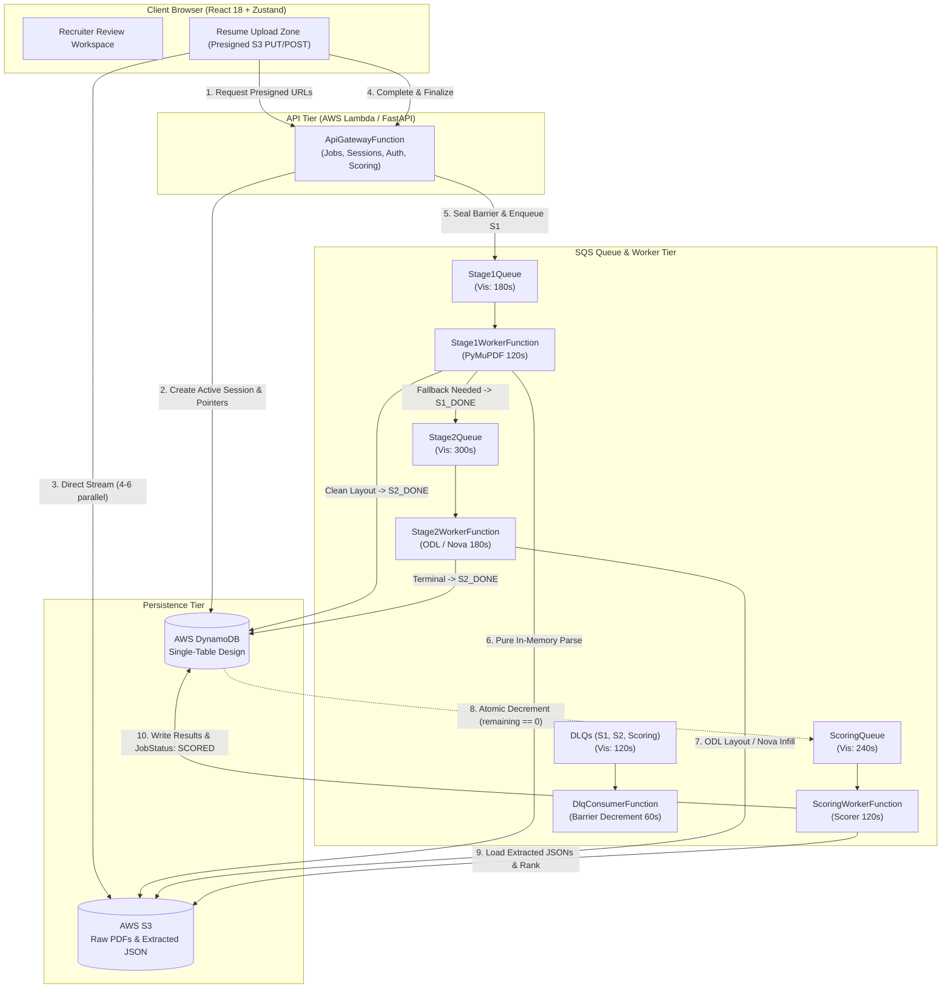
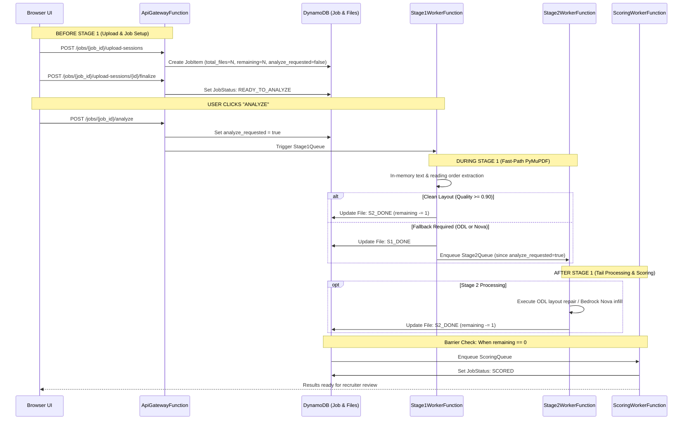
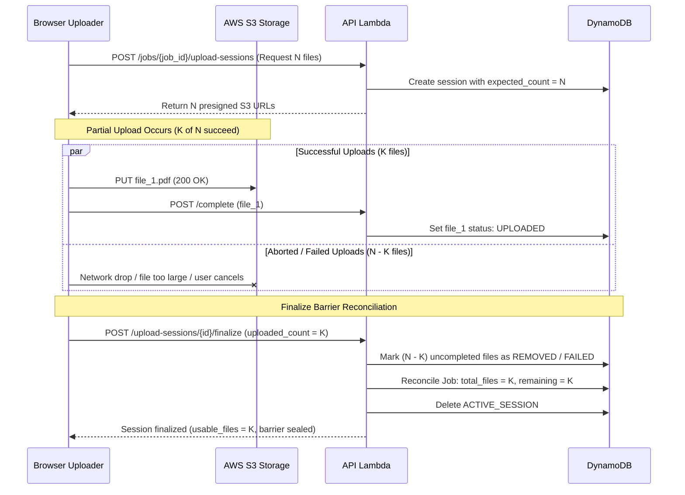
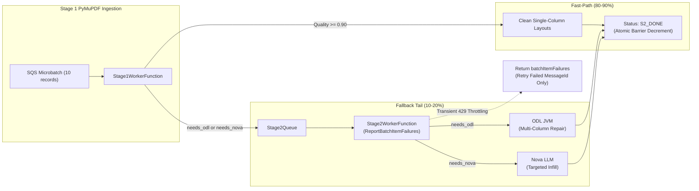
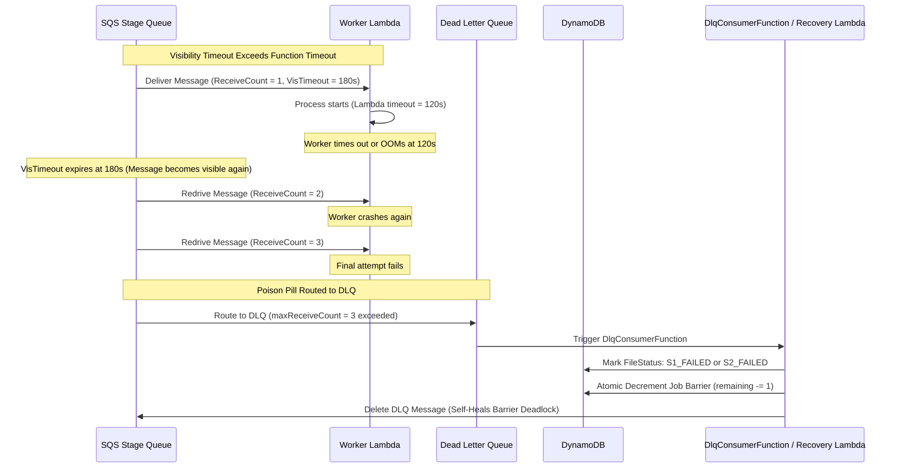
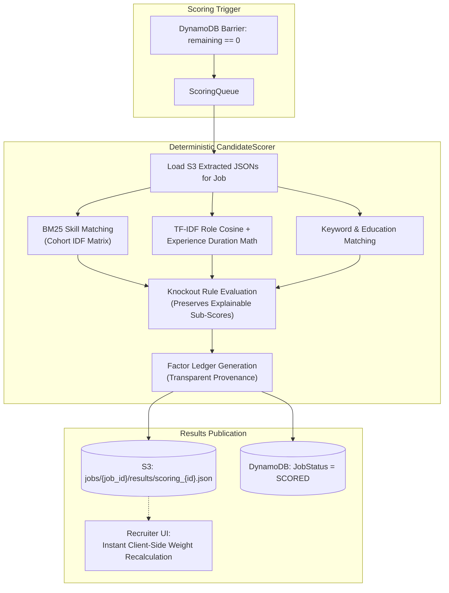

# architecture.md — SWYRA Sortlist Architecture Specification

> **Reviewed Baseline Commit:** `c9124c3de334c4b9024239acac4752a9bbb88d7e`  
> **Target Release:** `v2.2 — Durable Serverless Pipeline, Evidence Integrity, and Strict Relevance Scoring`  
> **Status:** Authoritative system architecture, serverless infrastructure, and data flow specification.

---

## 1. Architectural Principles

SWYRA Sortlist is architected as an **auditable, evidence-linked candidate review workspace**. It employs a standard AWS Serverless topology in production and a lightweight self-contained modular monolith in local development.

### Core Architectural Guarantees
1. **Direct Browser-to-S3 Uploads (Zero API Buffering):** The primary production upload path issues presigned S3 URLs (`POST /api/v2/jobs` or `POST /api/v2/jobs/{job_id}/upload-sessions`). Browsers stream multi-megabyte PDF files directly to S3 with bounded client concurrency (4–6 parallel PUT/POSTs). This eliminates multi-megabyte PDF body buffering in API Lambda RAM, reserving Lambda memory strictly for sub-50ms JSON execution (`create`, `complete`, `finalize`). The legacy backend upload proxy (`POST /api/v2/jobs/{job_id}/resumes`) is maintained strictly for local development and fallback compatibility.
2. **Decoupled Serverless Queues & Microbatches:** Document processing is segregated into independent, asynchronous queue stages:
   - **`Stage1Queue` / `Stage1WorkerFunction`:** High-speed in-memory PyMuPDF extraction and visual reading-order clustering. Single-threaded PyMuPDF per OS process.
   - **`Stage2Queue` / `Stage2WorkerFunction`:** Layout repair (OpenDataLoader PDF JVM) and targeted LLM infill (Bedrock Nova Micro).
   - **`ScoringQueue` / `ScoringWorkerFunction`:** 100% deterministic multi-signal candidate scoring and cohort BM25 ranking.
   - **Dead Letter Queues (`Stage1DLQ`, `Stage2DLQ`, `ScoringDLQ`):** Captured by `DlqConsumerFunction` to maintain atomic barrier accounting.
3. **Partial Batch Failure Isolation:** All Lambda SQS event source mappings enforce `ReportBatchItemFailures`. Visibility timeouts strictly exceed function execution timeouts (`Stage1Queue` 180s > 120s, `Stage2Queue` 300s > 180s, `ScoringQueue` 240s > 120s). Transient errors on a single document retry only that specific `messageId`, never re-driving peer records in the microbatch.
4. **Base-Table Key-Prefix Session Queries:** Active upload session tracking queries DynamoDB base-table items using `PK=ORG#{org_id}` and `SK begins_with('ACTIVE_SESSION#')`. This is an **org-partition key-prefix query, not an O(1) constant lookup, not a GSI, and does not guarantee 1 RCU**. It consumes read capacity proportional to matching session pointer count and payload size. Active pointers are strictly removed upon transition to `READY_TO_ANALYZE` or terminal states.
5. **Deterministic Scoring & Algorithmic Ethics:** Zero LLMs in the scoring path. Multi-signal ranking combines BM25 skills matching, TF-IDF role experience cosine similarity, keyword ratios, and education criteria into an auditable factor ledger. University prestige bonuses, employer prestige bonuses, and career gap penalties are permanently eliminated.

---

## 2. Serverless Component Topology

```mermaid
flowchart TD
    subgraph Browser ["Client Browser (React 18 + Zustand)"]
        UI["Recruiter Review Workspace"]
        UploadZone["Resume Upload Zone (Presigned S3 PUT/POST)"]
    end

    subgraph APILayer ["API Tier (AWS Lambda / FastAPI)"]
        API["ApiGatewayFunction<br/>(Jobs, Sessions, Auth, Scoring)"]
    end

    subgraph StorageLayer ["Persistence Tier"]
        S3[("AWS S3<br/>Raw PDFs & Extracted JSON")]
        DDB[("AWS DynamoDB<br/>Single-Table Design")]
    end

    subgraph QueueLayer ["SQS Queue & Worker Tier"]
        Q1["Stage1Queue<br/>(Vis: 180s)"] --> W1["Stage1WorkerFunction<br/>(PyMuPDF 120s)"]
        Q2["Stage2Queue<br/>(Vis: 300s)"] --> W2["Stage2WorkerFunction<br/>(ODL / Nova 180s)"]
        Q3["ScoringQueue<br/>(Vis: 240s)"] --> W3["ScoringWorkerFunction<br/>(Scorer 120s)"]
        DLQ["DLQs (S1, S2, Scoring)<br/>(Vis: 120s)"] --> W_DLQ["DlqConsumerFunction<br/>(Barrier Decrement 60s)"]
    end

    %% Upload & Extraction Triggers
    UploadZone -->|"1. Request Presigned URLs"| API
    API -->|"2. Create Active Session & Pointers"| DDB
    UploadZone -->|"3. Direct Stream (4-6 parallel)"| S3
    UploadZone -->|"4. Complete & Finalize"| API
    API -->|"5. Seal Barrier & Enqueue S1"| Q1

    %% Processing Flow
    W1 -->|"6. Pure In-Memory Parse"| S3
    W1 -->|"Clean Layout -> S2_DONE"| DDB
    W1 -->|"Fallback Needed -> S1_DONE"| Q2
    W2 -->|"7. ODL Layout / Nova Infill"| S3
    W2 -->|"Terminal -> S2_DONE"| DDB

    %% Barrier Scoring
    DDB -.->|"8. Atomic Decrement (remaining == 0)"| Q3
    W3 -->|"9. Load Extracted JSONs & Rank"| S3
    W3 -->|"10. Write Results & JobStatus: SCORED"| DDB
```

---

## 3. Core Lifecycle & Recovery Path Diagrams

### Lifecycle 1: Analyze Before, During, and After Stage 1

```mermaid
sequenceDiagram
    participant UI as Browser UI
    participant API as ApiGatewayFunction
    participant DDB as DynamoDB (Job & Files)
    participant S1 as Stage1WorkerFunction
    participant S2 as Stage2WorkerFunction
    participant SC as ScoringWorkerFunction

    Note over UI,API: BEFORE STAGE 1 (Upload & Job Setup)
    UI->>API: POST /jobs/{job_id}/upload-sessions
    API->>DDB: Create JobItem (total_files=N, remaining=N, analyze_requested=false)
    UI->>API: POST /jobs/{job_id}/upload-sessions/{id}/finalize
    API->>DDB: Set JobStatus: READY_TO_ANALYZE

    Note over UI,S1: USER CLICKS "ANALYZE"
    UI->>API: POST /jobs/{job_id}/analyze
    API->>DDB: Set analyze_requested = true
    API->>S1: Trigger Stage1Queue

    Note over S1,S2: DURING STAGE 1 (Fast-Path PyMuPDF)
    S1->>S1: In-memory text & reading order extraction
    alt Clean Layout (Quality >= 0.90)
        S1->>DDB: Update File: S2_DONE (remaining -= 1)
    else Fallback Required (ODL or Nova)
        S1->>DDB: Update File: S1_DONE
        S1->>S2: Enqueue Stage2Queue (since analyze_requested=true)
    end

    Note over S2,SC: AFTER STAGE 1 (Tail Processing & Scoring)
    opt Stage 2 Processing
        S2->>S2: Execute ODL layout repair / Bedrock Nova infill
        S2->>DDB: Update File: S2_DONE (remaining -= 1)
    end
    Note over DDB,SC: Barrier Check: When remaining == 0
    DDB->>SC: Enqueue ScoringQueue
    SC->>DDB: Set JobStatus: SCORED
    SC-->>UI: Results ready for recruiter review
```

---

### Lifecycle 2: Partial Browser Uploads & Barrier Reconciliation

```mermaid
sequenceDiagram
    participant Browser as Browser Uploader
    participant S3 as AWS S3 Storage
    participant API as API Lambda
    participant DDB as DynamoDB

    Browser->>API: POST /jobs/{job_id}/upload-sessions (Request N files)
    API->>DDB: Create session with expected_count = N
    API-->>Browser: Return N presigned S3 URLs

    Note over Browser,S3: Partial Upload Occurs (K of N succeed)
    par Successful Uploads (K files)
        Browser->>S3: PUT file_1.pdf (200 OK)
        Browser->>API: POST /complete (file_1)
        API->>DDB: Set file_1 status: UPLOADED
    and Aborted / Failed Uploads (N - K files)
        Browser-xS3: Network drop / file too large / user cancels
    end

    Note over Browser,DDB: Finalize Barrier Reconciliation
    Browser->>API: POST /upload-sessions/{id}/finalize (uploaded_count = K)
    API->>DDB: Mark (N - K) uncompleted files as REMOVED / FAILED
    API->>DDB: Reconcile Job: total_files = K, remaining = K
    API->>DDB: Delete ACTIVE_SESSION# pointer
    API-->>Browser: Session finalized (usable_files = K, barrier sealed)
```

---

### Lifecycle 3: SQS Worker Fallback Tail & Batch Item Failure Isolation

```mermaid
flowchart LR
    subgraph Ingestion ["Stage 1 PyMuPDF Ingestion"]
        S1_Batch["SQS Microbatch (10 records)"]
        S1_Proc["Stage1WorkerFunction"]
    end

    subgraph FastPath ["Fast-Path (80-90%)"]
        Clean["Clean Single-Column Layouts"]
        S2_Done["Status: S2_DONE<br/>(Atomic Barrier Decrement)"]
    end

    subgraph FallbackTail ["Fallback Tail (10-20%)"]
        S2_Queue["Stage2Queue"]
        S2_Proc["Stage2WorkerFunction<br/>(ReportBatchItemFailures)"]
        ODL["ODL JVM<br/>(Multi-Column Repair)"]
        Nova["Nova LLM<br/>(Targeted Infill)"]
    end

    S1_Batch --> S1_Proc
    S1_Proc -->|"Quality >= 0.90"| Clean --> S2_Done
    S1_Proc -->|"needs_odl or needs_nova"| S2_Queue

    S2_Queue --> S2_Proc
    S2_Proc -->|"needs_odl"| ODL
    S2_Proc -->|"needs_nova"| Nova
    ODL & Nova --> S2_Done
    S2_Proc -.->|"Transient 429 Throttling"| Retry["Return batchItemFailures<br/>(Retry Failed MessageId Only)"]
```

---

### Lifecycle 4: Expired Worker Lease & DLQ Recovery

```mermaid
sequenceDiagram
    participant SQS as SQS Stage Queue
    participant W as Worker Lambda
    participant DLQ as Dead Letter Queue
    participant DDB as DynamoDB
    participant R as DlqConsumerFunction / Recovery Lambda

    Note over SQS,W: Visibility Timeout Exceeds Function Timeout
    SQS->>W: Deliver Message (ReceiveCount = 1, VisTimeout = 180s)
    W->>W: Process starts (Lambda timeout = 120s)
    Note over W: Worker times out or OOMs at 120s
    Note over SQS: VisTimeout expires at 180s (Message becomes visible again)
    
    SQS->>W: Redrive Message (ReceiveCount = 2)
    Note over W: Worker crashes again
    SQS->>W: Redrive Message (ReceiveCount = 3)
    Note over W: Final attempt fails

    Note over SQS,DLQ: Poison Pill Routed to DLQ
    SQS->>DLQ: Route to DLQ (maxReceiveCount = 3 exceeded)
    DLQ->>R: Trigger DlqConsumerFunction
    R->>DDB: Mark FileStatus: S1_FAILED or S2_FAILED
    R->>DDB: Atomic Decrement Job Barrier (remaining -= 1)
    R->>SQS: Delete DLQ Message (Self-Heals Barrier Deadlock)
```

---

### Lifecycle 5: Selected-Cohort Publication & Explainable Scoring

```mermaid
flowchart TD
    subgraph Trigger ["Scoring Trigger"]
        Barrier["DynamoDB Barrier: remaining == 0"]
        ScoringQ["ScoringQueue"]
    end

    subgraph Scorer ["Deterministic CandidateScorer"]
        Load["Load S3 Extracted JSONs for Job"]
        BM25["BM25 Skill Matching<br/>(Cohort IDF Matrix)"]
        Exp["TF-IDF Role Cosine +<br/>Experience Duration Math"]
        KW["Keyword & Education Matching"]
        Knockout["Knockout Rule Evaluation<br/>(Preserves Explainable Sub-Scores)"]
        Ledger["Factor Ledger Generation<br/>(Transparent Provenance)"]
    end

    subgraph Publication ["Results Publication"]
        S3_Results[("S3: jobs/{job_id}/results/scoring_{id}.json")]
        DDB_Job[("DynamoDB: JobStatus = SCORED")]
        UI["Recruiter UI:<br/>Instant Client-Side Weight Recalculation"]
    end

    Barrier --> ScoringQ --> Load
    Load --> BM25 & Exp & KW
    BM25 & Exp & KW --> Knockout --> Ledger
    Ledger --> S3_Results & DDB_Job
    S3_Results -.-> UI
```

---

## 4. Key Architectural Clarifications

### A. Base-Table Key-Prefix Session Queries
- Active upload session verification queries DynamoDB using `PK=ORG#{org_id}` and `SK begins_with('ACTIVE_SESSION#')`.
- **Reality:** This is **not an $O(1)$ constant query, not a Global Secondary Index (GSI), and does not guarantee 1 RCU**.
- **Scalability:** It scans and reads all matching session pointers in the organization partition. To ensure predictable costs, active pointers are strictly deleted when sessions transition to `READY_TO_ANALYZE` or reach terminal states (`EXPIRED`, `FAILED`). Stale pointers are reconciled during admission.

### B. Direct S3 Upload Memory Reality
- **Client Direct Uploads:** Resumes are uploaded directly from the client browser to AWS S3 using presigned URLs.
- **Lambda Memory Reality:** Direct S3 uploads eliminate buffering multi-megabyte PDF bodies through the API Lambda memory. However, the API Lambda still consumes minimal memory for JSON requests (`create-upload-session`, `complete`, `finalize`). Memory size is set to 512 MB to support fast JSON serialization and low-latency crypto token generation.

### C. Concurrency: 6 Local Workers vs. AWS Lambda
- **Local Microbenchmark:** Spawns a maximum of 6 isolated operating system processes (`ProcessPoolExecutor`). PyMuPDF executes strictly single-threaded within each process to prevent C-library memory corruption.
- **AWS Lambda Scaling:** Lambda concurrency is **independent of local process limits**. In AWS Lambda, each invocation runs in its own isolated Firecracker microVM. Lambda scaling is governed by SQS trigger batch sizes (up to 10 records) and AWS account concurrency quotas. Six local processes does not mean six Lambda invocations.