# Project Structure

```
resume-ranking/
│
├── main.py                          # CLI entry point (<50 lines)
├── pyproject.toml                   # Dependencies & project metadata
├── uv.lock                         # Dependency lock file
├── README.md
├── .gitignore
│
├── src/                             # Application source code
│   ├── __init__.py
│   │
│   ├── config/                      # Configuration & settings
│   │   ├── __init__.py
│   │   └── settings.py              # Centralized path config (PROJECT_ROOT, etc.)
│   │
│   ├── core/                        # Core pipeline & utilities
│   │   ├── __init__.py
│   │   ├── pipeline.py              # PDFPipelineV3 — main extraction orchestrator
│   │   ├── quality_scoring.py       # Text/semantic quality scoring
│   │   ├── output_cleaning.py       # Tag stripping, text cleanup
│   │   └── section_assembly.py      # SectionContent base dataclass
│   │
│   ├── extractors/                  # Field extraction modules
│   │   ├── __init__.py
│   │   ├── layout/                  # Layout analysis pipeline
│   │   │   ├── layout_extractor.py  # PDF → DocumentStructure (PyMuPDF)
│   │   │   ├── block_detector.py    # Header/sidebar/main block detection
│   │   │   ├── section_detector.py  # Plain-text section header detection
│   │   │   ├── section_parser.py    # Token-based tagged text → structured data
│   │   │   └── domain_detector.py   # Resume vs non-resume classification
│   │   ├── contact/
│   │   │   └── contact_parser.py    # Name, email, phone, links extraction
│   │   ├── skills/
│   │   │   └── skills_parser.py     # Dictionary-based skill matching
│   │   ├── experience/
│   │   │   └── experience_parser.py # Work experience parsing
│   │   ├── education/
│   │   │   └── education_parser.py  # Education entry parsing
│   │   └── projects/
│   │       └── project_parser.py    # Project extraction with tech detection
│   │
│   ├── registries/                  # Canonical lookup tables
│   │   ├── __init__.py
│   │   ├── section_registry.py      # Section name aliases & resolution
│   │   └── skill_registry.py        # Skill normalization & matching
│   │
│   ├── ranking/                     # Candidate scoring engine
│   │   ├── __init__.py
│   │   ├── scorer.py                # CandidateScorer — 3-phase ranking
│   │   ├── bm25_scorer.py           # BM25 skill scoring
│   │   ├── tfidf_scorer.py          # TF-IDF & cosine similarity
│   │   └── similarity.py            # Experience, keyword, education scoring
│   │
│   ├── schemas/                     # Data models
│   │   ├── __init__.py
│   │   ├── extraction.py            # ExtractionResult, SectionContent
│   │   └── scoring.py               # JobDescription, ScoredCandidate
│   │
│   ├── services/                    # Service layer (FastAPI-ready)
│   │   ├── __init__.py
│   │   ├── extraction_service.py    # PDF extraction orchestrator
│   │   ├── ranking_service.py       # Candidate ranking orchestrator
│   │   └── document_service.py      # End-to-end extract + rank
│   │
│   └── api/                         # API layer (future FastAPI)
│       ├── __init__.py
│       ├── routes/
│       ├── dependencies/
│       └── middleware/
│
├── data/                            # Static data files
│   ├── resumes/                     # PDF resume files
│   ├── benchmark_resumes/           # Benchmark-specific resumes
│   └── dictionaries/
│       └── skills_dictionary.json   # Skills matching dictionary
│
├── scripts/                         # Utility scripts
│   └── benchmark.py                 # Benchmark capture tool
│
├── tests/                           # Test suite
│   ├── unit/
│   ├── integration/
│   │   └── test_scorer.py           # End-to-end ranking tests
│   └── benchmark/
│
├── benchmarks/                      # Benchmark data & baselines
│   ├── baselines/                   # Frozen benchmark JSON files
│   ├── reports/
│   └── outputs/
│
├── docs/                            # Documentation
│   ├── PROJECT_STRUCTURE.md         # This file
│   ├── SCORING_ARCHITECTURE.md
│   ├── DOMAIN_DECISION.md
│   ├── IMPLEMENTATION.md
│   └── implementation_plan.md
│
└── tmp/                             # Temporary files (gitignored)
```

## Module Dependency Flow

```mermaid
graph TD
    main["main.py"] --> pipeline["src/core/pipeline.py"]
    pipeline --> layout["src/extractors/layout/*"]
    pipeline --> contact["src/extractors/contact/*"]
    pipeline --> skills["src/extractors/skills/*"]
    pipeline --> experience["src/extractors/experience/*"]
    pipeline --> education["src/extractors/education/*"]
    pipeline --> projects["src/extractors/projects/*"]
    pipeline --> registry["src/registries/section_registry"]
    pipeline --> quality["src/core/quality_scoring"]
    pipeline --> cleaning["src/core/output_cleaning"]
    pipeline --> schemas["src/schemas/*"]

    scorer["src/ranking/scorer.py"] --> bm25["src/ranking/bm25_scorer"]
    scorer --> tfidf["src/ranking/tfidf_scorer"]
    scorer --> similarity["src/ranking/similarity"]
    scorer --> skill_reg["src/registries/skill_registry"]
    scorer --> schemas

    services["src/services/*"] --> pipeline
    services --> scorer
```



## Key Principles

1. **Single Responsibility**: Each extractor handles one field domain
2. **No Circular Imports**: Dependency flow is strictly top-down
3. **Config via Settings**: All paths resolve from `src/config/settings.py`
4. **Schema-First**: Public data models in `src/schemas/`
5. **Service Layer**: `src/services/` wraps core logic for API integration
