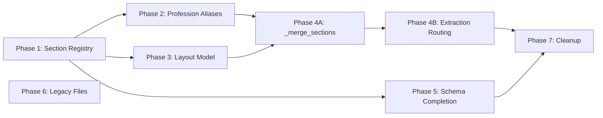

# Resume Intelligence Platform — Refactor Implementation Plan (v2)

## Background

The Resume Intelligence Platform is a PDF → Structured JSON → Ranking pipeline. Currently it has 20 resume PDFs for testing, a 1,388-line `pipeline.py`, 792-line `section_parser.py`, 664-line `layout_extractor.py`, 1,225-line `scorer.py`, and ~10 supporting parser modules. The system works but has accumulated architectural debt across 5 problem areas.

This plan addresses the 5 problems in priority order, organized into 7 implementation phases. Each phase is independently testable and can be merged without breaking the pipeline.

> [!NOTE]
> **Changes from v1** based on user feedback:
> - No `PublicationsParser` — store raw text placeholder only
> - No `publications_bonus` in scorer — keep core ranking signals only
> - Legacy files moved to `legacy/` folder, not deleted
> - Phase 3 split into 3A (safe: `_merge_sections` only) and 3B (extraction routing refactor)
> - Split accomplishments into `certifications` + `awards` + `achievements`

---

## Proposed Changes

### Phase 1: Section Registry (Problem 2 — Duplicate Section Definitions)
**Risk: Low | Impact: High | Dependency: None**

Unify the two competing section definition maps into a single source of truth.

---

#### [NEW] [section_registry.py](file:///home/swyra/Desktop/resume-ranking/section_registry.py)

Centralized section registry — the **only** place section names are defined.

**Canonical sections** (the target schema contract):

| Canonical | Description |
|-----------|-------------|
| `summary` | Profile, objective, about me |
| `experience` | Work history, employment, clinical/legal/teaching experience |
| `education` | Degrees, academic background |
| `projects` | Projects, cases, engagements, research work, campaigns |
| `skills` | Technical skills, core competencies, expertise |
| `certifications` | Certificates, licenses, courses, training |
| `languages` | Spoken languages |
| `awards` | Awards, honors, recognitions, distinctions |
| `achievements` | Key achievements, accomplishments, cost savings |
| `publications` | Publications, papers, articles (raw text only) |
| `references` | References |

**Alias map** (`SECTION_ALIASES`): uppercase raw header → lowercase canonical key.

**Public API**:
- `SECTION_ALIASES: Dict[str, str]` — the full alias map
- `CANONICAL_SECTIONS: List[str]` — ordered list of canonical keys
- `resolve(raw_name: str) -> Optional[str]` — resolve any raw header to canonical key

---

#### [MODIFY] [section_detector.py](file:///home/swyra/Desktop/resume-ranking/section_detector.py)

- **Remove** local `SECTION_HEADERS` dict and `_ALIAS_MAP` (lines 12–38)
- **Import** `SECTION_ALIASES` and `resolve` from `section_registry`
- `resolve_section_name()` delegates to `section_registry.resolve()`
- `SectionDetector` class behavior unchanged

---

#### [MODIFY] [section_parser.py](file:///home/swyra/Desktop/resume-ranking/section_parser.py)

- **Remove** local `SECTION_ALIASES` dict (lines 569–632)
- **Import** `SECTION_ALIASES` from `section_registry`
- All internal references (`ResumeAssembler._split_into_sections()`, etc.) use the imported alias

---

#### [MODIFY] [layout_extractor.py](file:///home/swyra/Desktop/resume-ranking/layout_extractor.py)

- Change import in `_parse_tagged_text()` (line 552): `from section_parser import SECTION_ALIASES` → `from section_registry import SECTION_ALIASES`

---

### Phase 2: Broaden Section Aliases & Profession Support (Problem 4)
**Risk: Low | Impact: Medium | Dependency: Phase 1**

Expand the section registry with profession-specific aliases.

---

#### [MODIFY] [section_registry.py](file:///home/swyra/Desktop/resume-ranking/section_registry.py)

Add profession-specific aliases:

| Canonical | New Aliases |
|-----------|-------------|
| `experience` | `Clinical Experience`, `Teaching Experience`, `Legal Experience`, `Practice Areas`, `Key Accounts`, `Deal Experience`, `Case Management`, `Patient Care Experience`, `Consulting Experience`, `Military Service` |
| `projects` | `Cases`, `Engagements`, `Research Work`, `Case Studies`, `Key Projects`, `Initiatives`, `Campaigns`, `Consulting Engagements`, `Client Projects`, `Portfolio` |
| `skills` | `Core Competencies`, `Professional Skills`, `Areas of Expertise`, `Specializations`, `Technical Proficiencies`, `Clinical Skills`, `Therapeutic Modalities`, `Key Strengths` |
| `certifications` | `Professional Licenses`, `Bar Admissions`, `Board Certifications`, `Accreditations`, `Continuing Education`, `Credentials` |
| `awards` | `Awards`, `Honors`, `Recognitions`, `Distinctions` |
| `achievements` | `Key Achievements`, `Accomplishments`, `Key Accomplishments` |
| `publications` | `Publications`, `Research Papers`, `Journal Articles`, `Conference Papers`, `Presentations`, `Authored Works` |

---

#### [MODIFY] [pipeline.py](file:///home/swyra/Desktop/resume-ranking/pipeline.py)

- Update `_generate_warnings()` (line 1367): Remove IT-centric warning `"No projects section found (developer resumes should have this)"`
- Replace with generic: `"Limited structured data extracted"` when quality score < 0.3

---

#### [MODIFY] [contact_parser.py](file:///home/swyra/Desktop/resume-ranking/contact_parser.py)

- Expand `_NOT_NAMES` set with profession-specific false positives:
  - Medical: `registered nurse`, `clinical director`, `medical officer`
  - Legal: `attorney at law`, `legal counsel`, `senior partner`
  - Finance: `financial analyst`, `investment banker`, `portfolio manager`
  - Education: `assistant professor`, `teaching assistant`

---

### Phase 3: Extend Layout Model (Problem 3 — Layout Too Simple)
**Risk: Medium | Impact: High | Dependency: Phase 1**

Add `SectionBlock` for arbitrary layout support. Additive change — existing fields preserved.

---

#### [MODIFY] [layout_extractor.py](file:///home/swyra/Desktop/resume-ranking/layout_extractor.py)

Add `SectionBlock` dataclass:

```python
@dataclass
class SectionBlock:
    """A detected section block with its content and metadata."""
    text: str                    # Cleaned text content
    section_type: Optional[str]  # Canonical section name (from registry) or None
    bbox: Optional[Tuple[float, float, float, float]] = None  # (x0, y0, x1, y1)
    confidence: float = 1.0      # Detection confidence
    source_column: str = "main"  # "left", "right", "full"
    parser_source: str = "layout"  # "layout", "section_detector", "fallback"
```

`parser_source` tracks which extraction path produced this block — critical for debugging extraction failures.

Extend `DocumentStructure`:
```python
@dataclass
class DocumentStructure:
    full_width_text: str
    sidebar_text: str
    main_text: str
    classified_lines: List[ClassifiedLine] = field(default_factory=list)
    hyperlinks: List[Dict[str, str]] = field(default_factory=list)
    section_blocks: List[SectionBlock] = field(default_factory=list)  # NEW
```

Add `_build_section_blocks()` method that converts classified lines + section tags into `SectionBlock` objects, called after `_build_document()`.

> [!IMPORTANT]
> **Additive only** — `full_width_text`, `sidebar_text`, `main_text` fields remain unchanged. `section_blocks` is an additional output for future use.

---

#### [MODIFY] [block_detector.py](file:///home/swyra/Desktop/resume-ranking/block_detector.py)

Pass through `section_blocks` in the return dict:
```python
"section_blocks": doc.section_blocks if hasattr(doc, 'section_blocks') else []
```

---

### Phase 4A: Add Section Merging (Problem 1 — First Safe Step)
**Risk: Low | Impact: Medium | Dependency: Phases 1–3**

> [!IMPORTANT]
> **This phase makes NO behavior changes.** It only adds a new `_merge_sections()` method and verifies all 20 PDFs produce identical output before and after.

---

#### [MODIFY] [pipeline.py](file:///home/swyra/Desktop/resume-ranking/pipeline.py)

Add new method to `PDFPipelineV3`:

```python
def _merge_sections(
    self,
    tagged_sections: Dict[str, str],
    plain_sections: Dict[str, str],
) -> Dict[str, str]:
    """Merge tagged (layout) and plain-text (detector) sections.
    Prefer tagged sections when available, fall back to plain-text.
    Returns dict keyed by canonical section names."""
    from section_registry import resolve
    
    merged = {}
    
    # 1. Add tagged sections (higher priority)
    for raw_key, content in tagged_sections.items():
        canonical = resolve(raw_key)
        if canonical and content.strip():
            if canonical not in merged or len(content) > len(merged[canonical]):
                merged[canonical] = content
    
    # 2. Fill gaps from plain-text detection
    for canonical, content in plain_sections.items():
        if canonical not in merged and content.strip():
            merged[canonical] = content
    
    return merged
```

**Verification**: Call `_merge_sections()` at the top of `_extract_resume_fields()`, but do **not** use its output for extraction yet. Log a comparison: do tagged+plain sections together cover more sections than either alone? Run against all 20 PDFs and confirm zero output changes.

**Extraction telemetry**: Add section-level telemetry to `ExtractionResult.metadata`:

```python
metadata = {
    "pdf_path": pdf_path,
    "layout_type": layout_type,
    "domain_signals": domain.signals[:5],
    # NEW — extraction telemetry
    "section_count": len(sections_found),
    "sections_found": sections_found,        # e.g. ["experience", "education", "skills"]
    "sections_missing": sections_missing,    # e.g. ["projects", "certifications"]
    "section_sources": section_sources,      # e.g. {"experience": "layout", "skills": "section_detector"}
}
```

This enables instant diagnosis when testing 20 PDFs — you see which sections are missing and which extraction path found each one.

---

### Phase 4B: Refactor Extraction Routing (Problem 1 — Core Change)
**Risk: High | Impact: Critical | Dependency: Phase 4A verified**

Restructure `_extract_resume_fields()` to use merged sections with clear primary → fallback chains.

---

#### [MODIFY] [pipeline.py](file:///home/swyra/Desktop/resume-ranking/pipeline.py)

Refactor `_extract_resume_fields()` (lines 177–442):

**Current flow** (two competing paths):
```
assembler → if has data, use it
else → section_detector → standalone parsers
```

**Refactored flow** (unified with clear fallbacks):
```
1. merged_sections = _merge_sections(tagged, plain)
2. For each field:
   Primary: dedicated parser on merged_sections text
   Fallback 1: assembler tokenized output
   Fallback 2: sidebar text
   Fallback 3: pattern-based extraction
```

**Specific changes**:
- Move `ResumeAssembler.assemble()` result to fallback position (not primary)
- Use `merged_sections` dict as primary text source for each parser
- Keep all existing fallback chains (sidebar education, date-tag experience, pattern-based) but organize under clear priority order
- Remove duplicate extraction attempts (currently skills are extracted 3 different ways and merged)

**Verification**: Run against all 20 PDFs. Compare output field-by-field. Accept only if:
- No name/email/phone regressions
- Skills count within ±2 of previous
- Experience/education count within ±1
- Ranking order unchanged in `test_scorer.py`

---

#### [MODIFY] [section_parser.py](file:///home/swyra/Desktop/resume-ranking/section_parser.py)

- `ResumeAssembler.assemble()` retains current tokenized parsing
- Remove `SidebarExtractor` from assembler — contact extraction stays in `ContactParser`
- `EmploymentParser` and `EducationParser` (embedded) remain but are called only through assembler for tagged-text path
- Long-term: retire as standalone parsers mature

---

### Phase 5: Target Schema Completion
**Risk: Low | Impact: Medium | Dependency: Phases 1, 4A**

---

#### [MODIFY] [pipeline.py](file:///home/swyra/Desktop/resume-ranking/pipeline.py)

Add `publications`, `awards`, `achievements` to output schema:

```python
return self._clean_output({
    "personal_info":      personal_info,
    "summary":            summary,
    "skills":             skills,
    "experience":         experience,
    "education":          education,
    "projects":           projects,
    "certifications":     certifications,
    "languages":          languages,
    "publications":       publications,       # NEW — raw text only
    "awards":             awards,             # NEW — split from accomplishments
    "achievements":       achievements,       # NEW — split from accomplishments
    "raw_text_sections":  raw_text_sections,
    "extraction_quality": extraction_quality,
})
```

**Extraction logic**:

- `publications`: If a `publications` section is detected (via registry), store its raw text as a list of strings (one per line/bullet). No structured parsing.
- `awards`: Split from current `accomplishments` bucket. Detect award-like language: "winner", "award", "honor", "recognition", "distinction", "employee of the year"
- `achievements`: Split from `accomplishments`. Detect metric-driven language: "reduced", "improved", "increased", "managed", "delivered", percentage patterns
- `certifications`: Keep existing logic. Entries with "certified", "certificate", "course", "training", "license" language

**Extraction quality score**: No changes for optional sections. Keep existing 6-factor scoring (name, email, skills, experience, education, contact).

**Scorer**: No changes. No `publications_bonus`. Core ranking signals remain: skills, experience, education, projects, certifications, keywords.

---

### Phase 6: Legacy File Organization
**Risk: None | Impact: Low | Dependency: None (can run anytime)**

---

#### [NEW] [legacy/](file:///home/swyra/Desktop/resume-ranking/legacy/)

Create `legacy/` directory and move unused files:

```
legacy/
├── field_parsers.py        # Finance/Legal/Medical/Research parsers (future use)
├── nlp_extractor.py        # NLTK/spaCy NER extractor (NER fallback path)
├── output_formatter.py     # Old ExtractionResult + OutputFormatter
└── README.md               # Why these files exist and when to use them
```

#### [NEW] [legacy/README.md](file:///home/swyra/Desktop/resume-ranking/legacy/README.md)

```markdown
# Legacy Modules

These modules are not currently used by the main pipeline (pipeline.py)
but are preserved for future use.

## field_parsers.py
Domain-specific parsers: FinanceParser, LegalParser, MedicalParser,
InvoiceParser, ResearchParser. Use when extending beyond resume domain.

## nlp_extractor.py
NLTK + spaCy NER extraction. Use as fallback when layout-based
extraction produces low-quality results.

## output_formatter.py
Old ExtractionResult wrapper. Superseded by pipeline.ExtractionResult.
```

---

### Phase 7: Cleanup & Import Fixes
**Risk: Low | Impact: Low | Dependency: All phases**

---

#### [MODIFY] [pipeline.py](file:///home/swyra/Desktop/resume-ranking/pipeline.py)

- Move inline imports to module level:
  - `from section_detector import resolve_section_name` (line 227)
  - `from contact_parser import _is_name_line` (lines 238, 253, 274)
- Consolidate `_SECTION_KW_FOR_NAME` with registry where possible
- Remove any dead code paths identified during Phase 4B

---

## Verification Plan

### After Every Phase

```bash
# Run full extraction on all 20 PDFs
for f in resume/*.pdf; do
  python main.py "$f" fields 2>/dev/null | \
  python -c "
import sys, json
d = json.load(sys.stdin)
pi = d.get('personal_info', {})
print(f\"{pi.get('name','?'):30s} sk={len(d.get('skills',[]))} exp={len(d.get('experience',[]))} edu={len(d.get('education',[]))} q={d.get('extraction_quality',0)}\")
"
done
```

### After Phase 4B (Critical)

```bash
# Run the full ranking test suite
python test_scorer.py

# Compare: top-3 rankings must be stable for all 4 JDs
```

### Regression Check Strategy

Before Phase 4B, capture baseline:
```bash
mkdir -p /tmp/baseline
for f in resume/*.pdf; do
  python main.py "$f" fields > "/tmp/baseline/$(basename $f .pdf).json" 2>/dev/null
done
```

After Phase 4B, compare:
```bash
for f in resume/*.pdf; do
  name=$(basename $f .pdf)
  diff <(python -c "import json; print(json.dumps(json.load(open('/tmp/baseline/${name}.json')), sort_keys=True, indent=2))") \
       <(python main.py "$f" fields 2>/dev/null | python -c "import sys,json; print(json.dumps(json.load(sys.stdin), sort_keys=True, indent=2))")
done
```

---

## Phase Execution Order



**Recommended execution**: P1 → P2 → P3 → P4A → (verify) → P4B → (verify again) → P5 → P6 → P7

- P1 + P2 can be done together (both registry work)
- P3 is structural prep for P4
- P4A is the safety gate before P4B
- **P5 strictly after P4B is verified stable** — do not change schema while extraction routing is in flux
- P6 and P7 are independent polish

---

## Summary of Changes from v1

| Item | v1 Plan | v2 Plan (Updated) |
|------|---------|-------------------|
| `PublicationsParser` | Build new module | ❌ Store raw text only |
| `publications_bonus` in scorer | Add bonus function | ❌ No scorer changes |
| Legacy files | Pending delete | Move to `legacy/` folder |
| Phase 3 (pipeline refactor) | Single phase rewrite | Split into **4A** (safe) + **4B** (risky) |
| Accomplishments | Merged into certs | Split: `certifications` + `awards` + `achievements` |
| Project aliases | New `case_studies` section? | All → `projects` canonical |
| Canva detection | Maybe add heuristic | ❌ Classify layouts structurally |
| Extraction quality | Maybe boost publications | ❌ No changes for optional sections |
