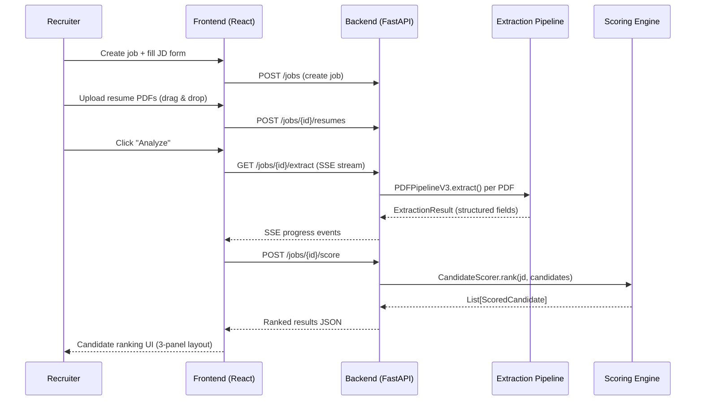

# 01 — Project Overview

## What Problem Does This System Solve?

The **Resume Intelligence Platform** automates the first-pass screening of job applicants. Given a set of resume PDFs and a structured job description (JD), the system:

1. **Extracts** structured data from each resume PDF (name, skills, experience, education, certifications, projects)
2. **Scores** each candidate against the JD across multiple dimensions (skill match, experience fit, keyword overlap, education alignment)
3. **Ranks** all candidates from best to worst fit, flagging anomalies and knockout disqualifications

The system replaces manual HR resume screening — which typically costs 6–7 seconds per resume at 250+ resumes per opening — with a deterministic, explainable scoring pipeline that processes the entire pool in seconds.

---

## Business Use Case

**Target user:** HR recruiters and hiring managers screening high-volume applicant pools.

**Core workflow:**

```
HR fills out JD form → Uploads resume PDFs → System extracts + scores → Ranked candidate list
```

The system is designed for:
- **High-volume screening** (benchmarked on 3,856 PDFs across 20 JDs)
- **Cross-domain hiring** (engineering, marketing, healthcare, finance, legal, hospitality, HR, education, sales, accounting, admin, construction — 13 supported domains)
- **Explainable decisions** (every score includes a detailed breakdown: which skills matched, why a candidate was knocked out, what bonuses applied)

---

## HR Workflow



---

## System Architecture (High Level)

```
resume-ranking/
├── backend/                    ← Python/FastAPI server
│   ├── main.py                 ← CLI entry point for extraction
│   ├── src/
│   │   ├── api/                ← FastAPI routes + app factory
│   │   ├── core/               ← PDF extraction pipeline (PDFPipelineV3)
│   │   ├── extractors/         ← Field-specific extractors (7 domains)
│   │   ├── ranking/            ← Scoring engine (BM25, TF-IDF, inference, domain)
│   │   ├── registries/         ← Skill graph, section aliases, domain proximity
│   │   ├── schemas/            ← Data models (ExtractionResult, ScoredCandidate)
│   │   ├── services/           ← Service wrappers (thin DI layer)
│   │   └── config/             ← Path settings
│   ├── scripts/                ← Maintenance scripts
│   └── tests/                  ← Integration tests + benchmarks
│
└── frontend/                   ← React + TypeScript + Vite
    └── src/
        ├── components/         ← UI components (3-panel layout)
        ├── store/              ← Zustand state management
        ├── hooks/              ← API call hooks
        └── lib/                ← API client + data mapping
```

---

## Technology Stack

| Layer | Technology | Purpose |
|-------|-----------|---------|
| **Backend** | Python 3.x + FastAPI | API server, PDF processing |
| **PDF Parsing** | PyMuPDF (fitz) | PDF text + layout extraction |
| **Frontend** | React + TypeScript + Vite | Recruiter UI |
| **State Management** | Zustand | Client-side state |
| **UI Components** | shadcn/ui + Tailwind CSS | Component library |
| **Streaming** | Server-Sent Events (SSE) | Real-time extraction progress |
| **Data Format** | JSON | All API communication |

---

## Key Design Principles

1. **Zero ML dependencies** — No NER, no transformers, no GPU. All extraction uses regex, heuristics, layout geometry, and dictionary matching. This makes the system deployable on any machine with Python.

2. **Deterministic scoring** — Given the same inputs, the system always produces the same output. No randomness, no model weights that drift.

3. **Explainable by default** — Every `ScoredCandidate` includes a full breakdown: matched/missing skills, knockout reasons, domain classification, anomaly flags, bonus sources. The UI renders all of this.

4. **"Run both, score both, pick best"** — The extraction pipeline runs multiple extraction strategies in parallel (assembler-based vs. standalone parsers) and uses internal scoring to pick the best result. This maximizes coverage across diverse PDF formats.

5. **Registry-driven** — Skills, sections, and domain proximity rules are externalized into JSON/Python registries. Adding a new skill alias or section header requires no code changes.
