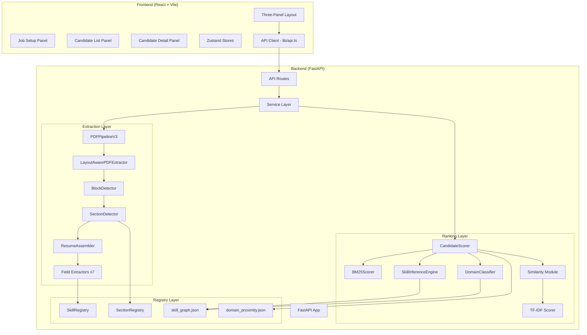

# 02 — Architecture Deep Dive

## System Architecture

The system is a two-tier architecture: a Python/FastAPI backend and a React/TypeScript frontend, communicating over HTTP/JSON and Server-Sent Events (SSE).



---

## Layer Responsibilities

### API Layer (`src/api/`)

| Component | File | Responsibility |
|-----------|------|----------------|
| `create_app()` | `app.py` | FastAPI factory — CORS, route registration |
| `/health` | `routes/health.py` | Backend reachability check |
| `/jobs/*` | `routes/jobs.py` | Job CRUD, resume upload, extraction SSE, scoring |

**State management:** In-memory `_jobs` dict. No database. Jobs are lost on server restart.

**Upload flow:**
1. Client POSTs files to `/jobs/{id}/resumes`
2. Server validates (PDF only, ≤10MB, SHA256 dedup)
3. Files saved to `backend/uploads/{job_id}/`

**Extraction flow:**
1. Client GETs `/jobs/{id}/extract` (SSE connection)
2. Server launches `asyncio.to_thread()` per PDF
3. Progress events streamed as files complete
4. Results stored in `_jobs[id]["extracted_candidates"]`

### Service Layer (`src/services/`)

Thin wrappers around core engines for dependency injection:

| Service | Wraps | Used By |
|---------|-------|---------|
| `ExtractionService` | `PDFPipelineV3` | `jobs.py` routes |
| `RankingService` | `CandidateScorer` | `document_service.py` only (unused) |
| `DocumentService` | Both above | Not used in production |

> **Note:** `jobs.py` instantiates `CandidateScorer` directly, bypassing `RankingService`.

### Extraction Layer (`src/core/`)

| Component | File | Purpose |
|-----------|------|---------|
| `PDFPipelineV3` | `pipeline.py` (2,496 lines) | Orchestrates all extraction |
| `quality_scoring` | `quality_scoring.py` | Text/semantic quality assessment |
| `output_cleaning` | `output_cleaning.py` | Tag stripping, text normalization |
| `section_assembly` | `section_assembly.py` | `SectionContent` dataclass (duplicate) |

### Extractor Modules (`src/extractors/`)

Each extractor is a self-contained module that parses one field type from raw text:

| Extractor | Directory | Output |
|-----------|-----------|--------|
| Contact | `contact/` | `personal_info` (name, email, phone, location, LinkedIn) |
| Education | `education/` | `education[]` (degree, institution, year) |
| Experience | `experience/` | `experience[]` (role, company, dates, description) |
| Skills | `skills/` | `skills[]` (flat list of skill strings) |
| Projects | `projects/` | `projects[]` (name, description, technologies) |
| Certifications | `certifications/` | `certifications[]` (name, issuer, date) |
| Layout | `layout/` | `LayoutAwarePDFExtractor`, `BlockDetector`, `SectionDetector` |

### Ranking Layer (`src/ranking/`)

| Component | File | Purpose |
|-----------|------|---------|
| `CandidateScorer` | `scorer.py` (1,022 lines) | Main 3-phase scoring orchestrator |
| `bm25_skill_score` | `bm25_scorer.py` | BM25-inspired skill relevance scoring |
| TF-IDF functions | `tfidf_scorer.py` | Tokenization, TF vectors, cosine similarity |
| Signal scorers | `similarity.py` | Experience, keyword, and education scoring |
| `SkillInferenceEngine` | `skill_inference.py` | Graph-based skill inference (implies/related) |
| `DomainClassifier` | `domain_classifier.py` (490 lines) | Professional domain classification (13 domains) |

### Registry Layer (`src/registries/`)

| Registry | File | Purpose |
|----------|------|---------|
| Skill Registry | `skill_registry.py` | Skill aliases, normalization, matching |
| Section Registry | `section_registry.py` | Section header → canonical name mapping |
| Skill Graph | `skill_graph.json` | Implies/related edges, domain tags (80KB) |
| Domain Proximity | `domain_proximity.json` | Cross-domain penalty matrix |

---

## Data Flow: End-to-End

```mermaid
flowchart LR
    PDF[Resume PDF] --> PyMuPDF["PyMuPDF\n(fitz)"]
    PyMuPDF --> Raw["Raw text +\nLayout blocks"]
    Raw --> BD[BlockDetector]
    BD --> SD[SectionDetector]
    SD --> RA[ResumeAssembler]

    Raw --> SP["Standalone\nParsers"]

    RA --> Fields1["Fields\n(Path A)"]
    SP --> Fields2["Fields\n(Path B)"]

    Fields1 --> MERGE["Score Both\nPick Best"]
    Fields2 --> MERGE

    MERGE --> NORM["Normalize\n+ Clean"]
    NORM --> QUALITY["Quality\nScoring"]
    QUALITY --> RESULT[ExtractionResult]

    RESULT --> SCORER["CandidateScorer\n(3 Phases)"]
    JD[Job Description] --> SCORER
    SCORER --> RANKED[ScoredCandidate[]]
```

---

## Concurrency Model

- **API:** Async FastAPI with `uvicorn` (single process by default)
- **Extraction:** Each PDF processed via `asyncio.to_thread()` — concurrent but CPU-bound in the thread pool
- **Scoring:** Synchronous — `CandidateScorer.rank()` processes all candidates in the calling thread
- **Frontend:** Single-page React app, no SSR

---

## Error Handling Strategy

| Layer | Strategy |
|-------|----------|
| API routes | `HTTPException` with structured error detail |
| Extraction | Try/catch per PDF → error event in SSE stream → other files continue |
| Scoring | Knockout reasons as data (not exceptions) — all candidates are scored |
| Frontend | `ApiError` class, `useApiCall` hook with auto-retry, `BlockingErrorAlert` overlay |
