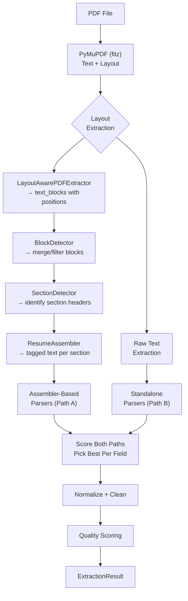

# 03 — Extraction Pipeline

## Overview

The extraction pipeline converts a raw PDF file into a structured `ExtractionResult` containing normalized fields (personal info, skills, experience, education, projects, certifications). It is the most complex subsystem in the codebase.

**Entry point:** `PDFPipelineV3.extract(pdf_path)` in `src/core/pipeline.py` (2,496 lines)

**Output:** `ExtractionResult` dataclass from `src/schemas/extraction.py`

---

## Pipeline Stages



---

## Stage 1: PDF Text Extraction

**Class:** `LayoutAwarePDFExtractor` (inner class within `pipeline.py`)

Uses PyMuPDF (`fitz`) to extract text blocks with positional metadata:
- Each block has `(x0, y0, x1, y1, text, block_no, block_type)`
- Preserves layout geometry for column detection and section boundary identification
- Handles multi-page documents
- Strips `(cid:XX)` font encoding artifacts

**Output:** List of positioned text blocks + full raw text

---

## Stage 2: Block Detection

**Class:** `BlockDetector` (inner class within `pipeline.py`)

Post-processes raw text blocks:
- Merges adjacent blocks that belong to the same logical paragraph
- Filters out header/footer noise (page numbers, document watermarks)
- Detects multi-column layouts
- Identifies bullet-point patterns and formats them consistently

---

## Stage 3: Section Detection

**Class:** `SectionDetector` (inner class within `pipeline.py`)

Identifies resume section boundaries using:
1. **Font-size heuristic** — section headers tend to be larger or bold
2. **Header matching** — matches against `SectionRegistry.SECTION_ALIASES` (200+ known headers)
3. **Positional heuristic** — headers are typically left-aligned, at the start of a line
4. **Tag generation** — outputs tagged text like `[EXPERIENCE]...[/EXPERIENCE]`

**Registry dependency:** `src/registries/section_registry.py` — maps 200+ raw headers to 11 canonical sections.

---

## Stage 4: Resume Assembly

**Class:** `ResumeAssembler` (inner class within `pipeline.py`)

Takes tagged section text and runs **assembler-based extraction** (Path A):
- Uses the `[JOB_TITLE]`, `[DATE]`, `[BULLET]` tags to structure experience entries
- Handles date range parsing for experience/education
- This path is strongest when the PDF has clear section headers and consistent formatting

---

## Stage 5: Standalone Parsers (Path B)

For each field type, a standalone parser extracts data directly from raw text without relying on section detection:

| Parser | Module | Strategy |
|--------|--------|----------|
| **Contact** | `extractors/contact/contact_parser.py` | Regex patterns for email, phone, name, location, LinkedIn |
| **Education** | `extractors/education/` | Degree keyword matching, institution detection, date extraction |
| **Experience** | `extractors/experience/` | Role/company pattern matching, date range parsing, bullet grouping |
| **Skills** | `extractors/skills/` | Dictionary matching against `skill_registry.py`, raw text scanning |
| **Projects** | `extractors/projects/` | Project header detection, technology extraction from descriptions |
| **Certifications** | `extractors/certifications/` | Cert name extraction, issuer identification, date parsing |

---

## Stage 6: Result Arbitration ("Run Both, Score Both, Pick Best")

The pipeline runs **both extraction paths** for experience, education, and other fields, then picks the better result:

```python
# Pseudocode from pipeline.py
assembler_experience = path_a_extract_experience(tagged_text)
standalone_experience = path_b_extract_experience(raw_text)

score_a = _score_experience_entries(assembler_experience)
score_b = _score_experience_entries(standalone_experience)

experience = assembler_experience if score_a >= score_b else standalone_experience
```

Scoring heuristics consider:
- Number of entries extracted
- Completeness (role + company + dates)
- Date parsability
- Duplication detection

---

## Stage 7: Normalization and Cleaning

After field arbitration, the pipeline applies:

1. **Tag stripping** — `output_cleaning.strip_tags()` removes all `[TAG]...[/TAG]` markup from final output
2. **Recursive strip** — `output_cleaning.recursive_strip()` walks nested dicts/lists and strips tags from all string values
3. **Experience deduplication** — removes duplicate entries by comparing (role, company, dates) tuples
4. **Education cleanup** — `_fix_education()` removes entries with insufficient data
5. **Certification cleanup** — `_fix_certifications()` removes noise entries (achievement descriptions, garbled text, dates-only)
6. **Quality scoring** — `quality_scoring.compute_quality()` assesses extraction completeness

---

## Stage 8: Quality Assessment

Three quality functions in `src/core/quality_scoring.py`:

| Function | Score Range | What It Measures |
|----------|------------|-----------------|
| `compute_quality()` | 0.0–1.0 | Structured data completeness (name, email, skills ≥3, experience, education, location/phone) |
| `compute_text_quality()` | 0.0–1.0 | Raw text corruption detection (alpha ratio, word length, cid artifacts, garbled runs) |
| `compute_semantic_quality()` | 0.0–1.0 | Linguistic plausibility (vowel patterns, consonant runs, mid-word capitalization) |

**Output:** `extraction_quality` field on `ExtractionResult`, used by the scorer to flag low-confidence extractions.

---

## Output Schema

```python
@dataclass
class ExtractionResult:
    document_id: str           # Filename-based identifier
    domain: str                # "resume" (always, for now)
    domain_confidence: float   # 1.0 for resumes
    extraction_strategy: str   # "assembler" | "standalone" | "hybrid"
    page_count: int
    layout_type: str           # "single-column" | "multi-column"
    fields: Dict[str, Any]     # The extracted structured data
    warnings: List[str]        # Extraction warnings
    metadata: Dict[str, Any]   # Raw text, block data, section data
```

### `fields` Dictionary Structure

```json
{
  "personal_info": {
    "name": "John Doe",
    "email": "john@example.com",
    "phone": "+1-555-0100",
    "location": "New York, NY",
    "linkedin": "linkedin.com/in/johndoe"
  },
  "summary": "Experienced backend engineer...",
  "skills": ["Python", "Django", "PostgreSQL", "Docker", "AWS"],
  "experience": [
    {
      "role": "Senior Backend Engineer",
      "company": "Acme Corp",
      "start": "January 2020",
      "end": "Present",
      "description": "Led migration to microservices...",
      "achievements": ["Reduced latency by 40%", "Mentored 5 junior developers"]
    }
  ],
  "education": [
    {
      "degree": "B.S. Computer Science",
      "institution": "MIT",
      "year": "2018"
    }
  ],
  "projects": [
    {
      "name": "OpenSource CMS",
      "description": "Built a headless CMS...",
      "technologies": ["React", "GraphQL", "Node.js"]
    }
  ],
  "certifications": [
    {
      "name": "AWS Solutions Architect",
      "issuer": "Amazon",
      "date": "2022"
    }
  ],
  "extraction_quality": 0.83,
  "raw_text_sections": {
    "full_text": "..."
  }
}
```

---

## Warnings System

The pipeline generates human-readable warnings stored on the `ExtractionResult`:

| Condition | Warning |
|-----------|---------|
| No name extracted | "Could not extract name — check PDF formatting" |
| No email found | "No email found" |
| No experience entries | "No experience entries found" |
| No skills detected | "No skills detected" |
| Low extraction quality (<0.3) | "Limited structured data extracted — PDF may need OCR or manual review" |
