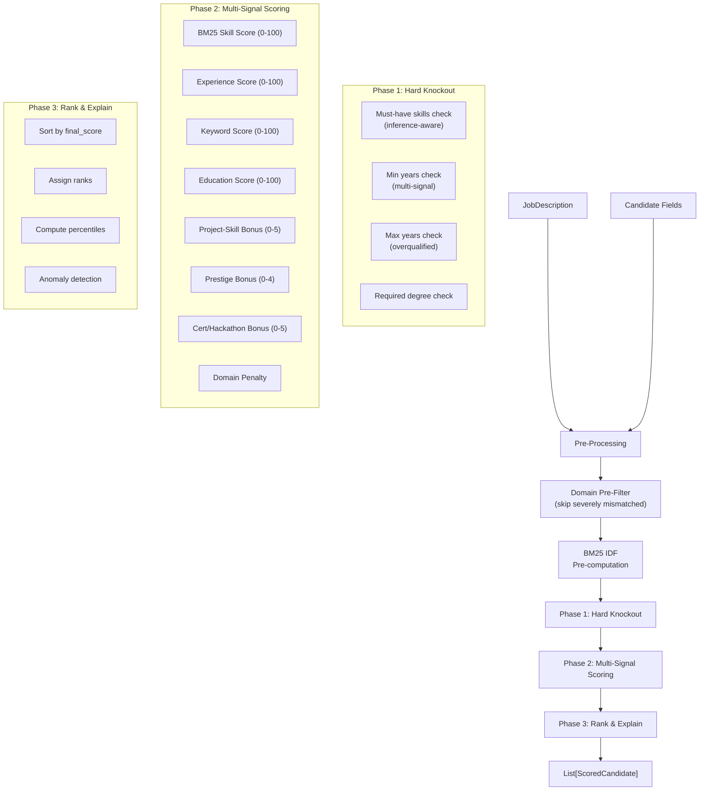

# 04 — Ranking Pipeline

## Overview

The ranking pipeline takes extracted candidate data and a structured job description, then produces a scored, sorted, and annotated list of `ScoredCandidate` objects. It operates in three phases.

**Entry point:** `CandidateScorer.rank(jd, candidates)` in `src/ranking/scorer.py`

**Output:** `List[ScoredCandidate]` sorted by `final_score` descending

---

## 3-Phase Architecture



---

## Pre-Processing

### Domain Pre-Filter

Before scoring any candidate, the system classifies both the JD and each candidate into a professional domain (engineering, healthcare, legal, etc.). Candidates with **severe domain mismatch** (penalty ≤ −60 in the domain proximity matrix) are filtered out entirely.

```python
# Example: healthcare candidate applying to a software engineering JD
# Penalty = -80 → filtered out before scoring
```

**Filter thresholds:**
- Both JD and candidate confidence must be ≥ 0.35
- Domain penalty must be ≤ −60
- Engineering ↔ Construction pairs are exempt (related domains)

### BM25 IDF Pre-computation

IDF values for all JD skills are computed once across the entire filtered candidate pool using `precompute_bm25_idf()`. This avoids O(n²) recomputation per candidate.

---

## Phase 1: Hard Knockout

Knockout checks determine if a candidate is immediately disqualified. Knocked-out candidates receive `final_score = 0.0` but still have their sub-scores computed for reporting.

### 1a. Must-Have Skills (Inference-Aware)

```
For each must-have skill:
  1. Check structured skills list (direct + alias match)
  2. Check skill-bearing text sections (regex with word boundaries)
  3. Check inference engine (weight ≥ 0.75 satisfies must-have)
  → If still missing: KNOCKOUT
```

**Important:** Only skill-bearing sections are searched (not raw full text) to avoid false positives from URLs, footers, and email addresses.

### 1b. Minimum Years

Multi-signal check:
- Parsed experience years from structured dates
- Number of experience entries (≥2 entries → leniency)
- Raw text search for "X years of experience" patterns
- Only knocks out if: no entries AND raw text confirms low experience AND parsed years < 50% of minimum

### 1c. Maximum Years (Overqualified)

Hard knockout if `total_years > max_years`. This is a constraint, not a preference — e.g., "0-2 years, junior role" strictly excludes senior candidates.

### 1d. Required Degree

Compares candidate's best degree level (numeric scale 0-5) against the JD requirement. Also checks raw text for degree mentions as fallback.

---

## Phase 2: Multi-Signal Scoring

Four base scores (each 0-100) plus three bonus categories:

### Skill Score — BM25 (`bm25_scorer.py`)

**Algorithm:** BM25-inspired scoring treating each candidate's skill list as a "document" and JD skills as a "query."

```
For each JD skill:
  tf = inference_weight (1.0 explicit, 0.75 inferred, 0.50 related, 0.0 missing)
  idf = log((N - df + 0.5) / (df + 0.5) + 1.0)
  score += idf * (tf * (k1 + 1)) / (tf + k1 * (1 - b + b * doc_len / avg_len))

final = (score / max_possible_score) * 100
```

**Parameters:** k1=1.5, b=0.75 (BM25 standard)

**Domain penalty:** If the candidate's domain mismatches the JD's domain, the skill score is penalized:
```
skill_score = skill_score * (1.0 + penalty / 100.0)
# e.g., penalty = -80 → skill_score *= 0.20
```

### Experience Score (`similarity.py`)

Three sub-signals combined:
- **Title similarity (40%)** — TF-IDF cosine similarity between JD title and candidate's role titles
- **Years in range (40%)** — 100 if within min/max, linear scale-down below min, 80 if over max
- **Recency (20%)** — 100 if currently employed, 85 if ≤2yr, 60 if ≤5yr, 30 if >5yr

### Keyword Score (`similarity.py`)

```
For each JD keyword:
  1. Search all text variants (from KEYWORD_ALIASES) in raw text
  2. Check skill aliases for keyword match
  → matched count / total keywords * 100
```

### Education Score (`similarity.py`)

Two sub-signals combined:
- **Degree level match (60%)** — Numeric comparison using DEGREE_LEVELS scale
- **Field similarity (40%)** — TF-IDF cosine similarity between degree text and preferred field

### Bonus: Project-Skill Match (0-5 pts)

Checks if candidate's projects use technologies matching JD skills. Scans both structured `technologies` lists and project description text.

### Bonus: Prestigious Companies (0-4 pts)

2.0 points per recognized employer (FAANG, consulting firms, major banks, etc.), capped at 4.0. Matches against 100+ hardcoded company names.

### Bonus: Certifications & Hackathons (0-5 pts)

- 0.15 per relevant certification
- 0.25 per prestigious-issuer certification
- 0.5 for hackathon participation
- 1.0 for hackathon wins

---

## Phase 3: Rank & Explain

### Weighted Final Score

```python
base_score = (
    skill_score * weights['skills'] +        # default 0.40
    experience_score * weights['experience'] + # default 0.25
    keyword_score * weights['keywords'] +      # default 0.20
    education_score * weights['education']     # default 0.15
)

# If JD has no keywords, redistribute keyword weight proportionally
# to the other three dimensions.

total_bonus = project_bonus + prestige_bonus + cert_bonus
final_score = min(100.0, base_score + total_bonus)
```

### Ranking and Percentiles

1. Sort by `(not knocked_out, final_score)` descending
2. Assign 1-based ranks
3. Compute percentiles: `percentile = (score / max_active_score) * 100`

### Anomaly Detection

| Flag | Condition |
|------|-----------|
| FRESHER | No experience at all |
| OVERQUALIFIED | total_years > max_years × 1.5 |
| GAP | >6 month gap between consecutive jobs |
| LOW_QUALITY | extraction_quality < 0.5 |

---

## Output Schema: `ScoredCandidate`

```python
@dataclass
class ScoredCandidate:
    name: str
    document_id: str
    final_score: float              # 0.0–100.0
    percentile: float               # 0.0–100.0
    rank: int                       # 1-based
    knocked_out: bool
    knockout_reasons: List[str]

    # Sub-scores (0-100 each)
    skill_score, experience_score, keyword_score, education_score: float

    # Bonuses
    project_bonus, prestige_bonus, cert_bonus: float

    # Weighted contributions
    skill_weighted, experience_weighted, keyword_weighted, education_weighted: float

    # Breakdowns
    matched_must_have, missing_must_have: List[str]
    matched_nice_to_have, matched_keywords, missing_keywords: List[str]
    extra_skills, project_skill_matches, prestigious_companies, relevant_certs: List[str]

    # Inference
    skill_matches: List[Dict]       # Full SkillMatchResult dicts
    matched_inferred, matched_related: List[str]

    # Domain
    candidate_domain, candidate_subdomain: str
    domain_confidence, domain_penalty: float

    # Experience
    total_exp_years: float
    best_title_match: str

    # Education
    degree_level, degree_field: str

    anomalies: List[str]
    extraction_quality: float
```
