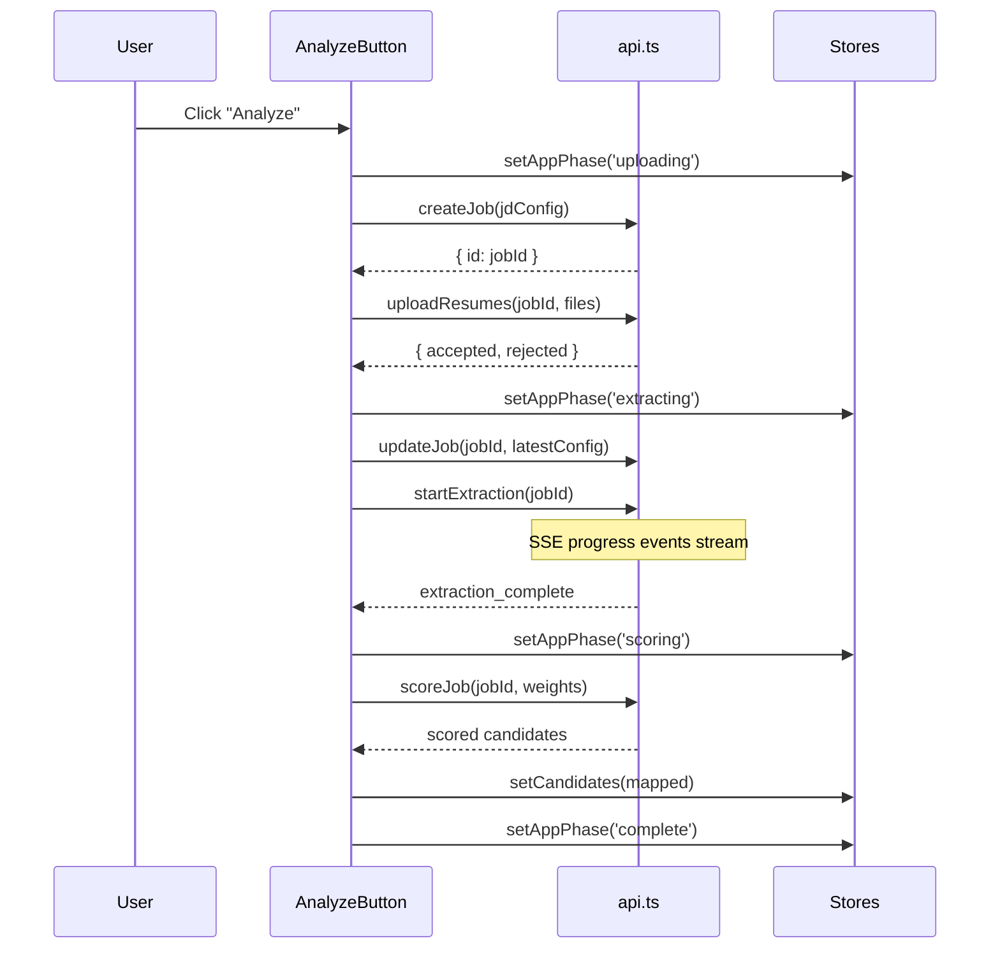

# 10 — Frontend Architecture

## Overview

The frontend is a single-page React application built with TypeScript, Vite, and Zustand for state management. It provides a three-panel recruiter interface for defining job requirements, uploading resumes, and reviewing ranked candidates.

**Stack:** React 18 + TypeScript + Vite + Zustand + shadcn/ui + Tailwind CSS

---

## Application Structure

```
frontend/src/
├── App.tsx                     ← Root component
├── main.tsx                    ← Vite entry point
├── components/
│   ├── layout/                 ← App shell components
│   │   ├── AppHeader.tsx       ← Top navigation bar
│   │   ├── ThreePanelLayout.tsx ← 3-panel split view
│   │   ├── BackendHealthGate.tsx ← Cold-start / connectivity gate
│   │   ├── BlockingErrorAlert.tsx ← Full-screen error overlay
│   │   ├── UploadProgressBar.tsx ← Upload progress indicator
│   │   └── ColdStartLoader.tsx  ← Loading animation
│   ├── job-setup/              ← Left panel components
│   │   ├── JobSetupPanel.tsx   ← Container for all JD form sections
│   │   ├── JobInfoSection.tsx  ← Title + department
│   │   ├── JobDescriptionSection.tsx ← Free-text description
│   │   ├── SkillTagsSection.tsx ← Must-have / nice-to-have skill tags
│   │   ├── ExperienceSection.tsx ← Min/max years
│   │   ├── EducationSection.tsx ← Degree level + field
│   │   ├── KeywordsSection.tsx  ← Keyword tags
│   │   ├── WeightsSection.tsx   ← Scoring weight sliders
│   │   └── AnalyzeButton.tsx    ← Triggers upload + extraction + scoring
│   ├── candidates/             ← Center panel components
│   │   ├── CandidateListPanel.tsx ← Candidate list container
│   │   ├── CandidateRow.tsx    ← Individual candidate row
│   │   ├── CandidateFilters.tsx ← Signal filter + search + sort
│   │   ├── CandidateListFooter.tsx ← Stats footer
│   │   ├── CenterPanelLoader.tsx ← Extraction progress UI
│   │   └── ResumeUploadZone.tsx ← Drag-and-drop upload area
│   ├── detail/                 ← Right panel components
│   │   ├── CandidateDetailPanel.tsx ← Detail view container
│   │   ├── CandidateHeader.tsx ← Name, title, score badge
│   │   ├── MatchScoreSection.tsx ← Score breakdown visualization
│   │   ├── SkillBreakdown.tsx  ← Matched/missing/extra skills
│   │   ├── KnockoutChecks.tsx  ← Knockout reason display
│   │   ├── ExperienceTimeline.tsx ← Work history timeline
│   │   ├── EducationSection.tsx ← Education entries
│   │   ├── FlagsSection.tsx    ← Anomaly flags display
│   │   └── CandidateActions.tsx ← Status/note actions
│   └── ui/                     ← shadcn/ui primitives
├── store/                      ← State management
│   ├── app-store.ts            ← App-level UI state
│   ├── job-store.ts            ← JD form state
│   ├── candidate-store.ts      ← Candidate list + selection state
│   └── types.ts                ← TypeScript interfaces
├── hooks/
│   └── useApiCall.ts           ← API call wrapper hook
└── lib/
    ├── api.ts                  ← Centralized API client
    ├── mapScoredCandidate.ts   ← Backend → frontend data mapping
    └── utils.ts                ← Utility functions
```

---

## Three-Panel Layout

```
┌─────────────┬──────────────────┬─────────────────┐
│  Job Setup  │  Candidate List  │ Candidate Detail │
│   (Left)    │    (Center)      │    (Right)       │
│             │                  │                  │
│ Title       │ Search / Filter  │ Name / Score     │
│ Department  │ ┌──────────────┐ │ Score Breakdown  │
│ Skills      │ │ Candidate 1  │ │ Skill Match      │
│ Experience  │ │ Candidate 2  │ │ Knockout Checks  │
│ Education   │ │ Candidate 3  │ │ Experience       │
│ Keywords    │ │ Candidate 4  │ │ Education        │
│ Weights     │ │ ...          │ │ Flags            │
│             │ └──────────────┘ │ Actions          │
│ [Analyze]   │ Stats Footer     │                  │
└─────────────┴──────────────────┴─────────────────┘
```

---

## State Management (Zustand)

Three separate stores, each with clear ownership:

### `app-store.ts` — Application Phase

```typescript
type BackendStatus = 'checking' | 'waking-up' | 'ready' | 'unreachable';
type AppPhase = 'idle' | 'uploading' | 'extracting' | 'scoring' | 'complete';

interface AppStore {
  backendStatus: BackendStatus;
  appPhase: AppPhase;
  uploadProgress: UploadProgress;
  sseRetryCount: number;
  blockingError: BlockingError | null;
  jobId: string | null;
}
```

### `job-store.ts` — JD Form State

```typescript
interface Job {
  title: string;
  department: string;
  description: string;
  mustHaveSkills: string[];
  niceToHaveSkills: string[];
  minYears: number;
  maxYears: number;
  educationLevel: EducationLevel;
  educationField: string;
  keywords: string[];
  weights: { skills: number; experience: number; keywords: number; education: number };
}
```

Default weights: `skills=40, experience=25, keywords=20, education=15`

### `candidate-store.ts` — Candidate Data + UI State

```typescript
interface CandidateStore {
  candidates: Candidate[];
  selectedId: string | null;
  filterSignal: Signal | 'all';
  sortField: 'score' | 'name';
  searchQuery: string;
  showKnockouts: boolean;
  upload: UploadState;
}
```

Includes computed selectors: `getFilteredCandidates()`, `getSelectedCandidate()`

---

## API Client (`lib/api.ts`)

**Design rule:** Every backend call goes through this module. No raw `fetch()` in components.

| Function | Method | Endpoint | Notes |
|----------|--------|----------|-------|
| `checkHealth()` | GET | `/health` | 3s timeout |
| `createJob(payload)` | POST | `/jobs` | Returns job ID |
| `updateJob(id, payload)` | PATCH | `/jobs/{id}` | Partial update |
| `uploadResumes(id, files, onProgress)` | POST | `/jobs/{id}/resumes` | XHR for progress |
| `startExtraction(id, onEvent, onError, onComplete)` | GET | `/jobs/{id}/extract` | SSE stream |
| `scoreJob(id, weights)` | POST | `/jobs/{id}/score` | Returns candidates |

### Error Handling

```typescript
class ApiError extends Error {
  status: number;
  body?: unknown;
}
```

Upload uses `XMLHttpRequest` (not `fetch`) for upload progress events. SSE uses `EventSource` API.

---

## Workflow: "Analyze" Button

The `AnalyzeButton.tsx` component orchestrates the full analysis workflow:



---

## Data Mapping (`lib/mapScoredCandidate.ts`)

Transforms the backend `ScoredCandidate` dict into the frontend `Candidate` type:

| Backend Field | Frontend Field | Transformation |
|--------------|----------------|----------------|
| `name` | `name` | Direct |
| `final_score` | `overallScore` | Direct |
| `rank` | `rank` | Direct |
| `knocked_out` | `signal` | `'knockout'` if true, else signal logic |
| `skill_weighted` | `scoreBreakdown.skills` | Direct |
| `matched_must_have` | `skillMatch.matched` | Direct |
| `knockout_reasons` | `knockoutChecks[]` | Mapped to `{label, passed, detail}` |
| `anomalies` | `flags[]` | Mapped to `{type, message}` |
| `experience` | `experience[]` | Mapped from backend format |

### Signal Classification

```typescript
if (knocked_out) signal = 'knockout'
else if (score >= 70) signal = 'strong'
else if (score >= 50) signal = 'good'
else signal = 'fair'
```

---

## Backend Health Gate

`BackendHealthGate.tsx` wraps the entire app and checks backend connectivity on mount:

```
checking → poll /health every 2s
  → 200 OK → 'ready' → render app
  → timeout → 'waking-up' → show cold-start loader
  → 5 failures → 'unreachable' → show error
```
