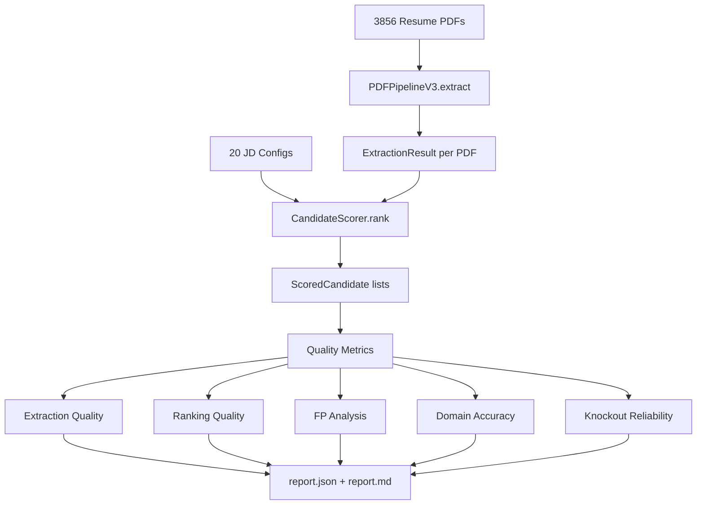

# 11 — Benchmark System

## Overview

The benchmark system validates the extraction and ranking engines against a large corpus of real resumes. It tracks quality metrics across versions, identifies regressions, and provides FP/FN analysis.

---

## Benchmark Versions

| Version | Status | Corpus | JDs | Location |
|---------|--------|--------|-----|----------|
| **v3** | **Superseded** | ~100 PDFs | 5 | `tests/benchmark_v3/` |
| **v4** | **Active (production)** | 3,856 PDFs | 20 | `tests/benchmark_v4/` |

---

## V4 Benchmark (Active)

### Location

```
tests/benchmark_v4/
├── main.py                  ← Runner (77K lines — includes JD definitions + scoring logic)
├── report.json              ← Machine-readable results (374KB)
├── report.md                ← Human-readable report (42KB)
├── V9_REPORT.md             ← Latest remediation report (20KB)
├── ROOT_CAUSE_REPORT.md     ← FP root cause analysis (7KB)
├── dedup_resumes.py         ← One-time corpus dedup utility
├── report_v6_backup.md      ← Obsolete backup (should be deleted)
└── resumes/                 ← Test resume corpus
```

### Metrics Tracked

| Category | Metrics | Description |
|----------|---------|-------------|
| **Overall Score** | 0–100 | Composite quality score |
| **Extraction Quality** | 0–100 | Name, email, skills, experience extraction accuracy |
| **Ranking Quality** | 0–100 | Percentage of top-5 candidates that are domain-relevant |
| **FP Control** | 0–100 | False positive rate (wrong-domain candidates in top results) |
| **Knockout Reliability** | 0–100 | Correctness of must-have / min-years / degree knockouts |
| **Domain Accuracy** | percentage | Domain classification correctness |
| **True FP Rate** | percentage | False positives as % of total ranked candidates |

### V9 Results (Latest)

| Metric | Score |
|--------|-------|
| Overall Score | **86/100** |
| Verdict | **🔵 PRODUCTION READY** |
| True FP Rate | **1.5% (3 cases)** |
| FP Control | **92/100** |
| Domain Accuracy | **97.8%** |
| Ranking Quality | **86/100** |
| Extraction Quality | **72/100** |
| Knockout Reliability | **100/100** |

### Version History

| Version | Score | Verdict | Key Change |
|---------|-------|---------|------------|
| V6 | ~65 | Beta | Initial benchmark |
| V8 | 78 | Beta Ready | Scorer improvements |
| V9 | 86 | Production Ready | Domain classifier remediation |

---

## How the Benchmark Works

### JD Definitions

The benchmark runner defines 20 job descriptions covering all 13 supported domains:

```python
# Example JD from benchmark main.py
JD_CONFIGS = [
    {
        "title": "Backend Engineer",
        "must_have_skills": ["Python", "SQL", "REST API"],
        "nice_to_have_skills": ["Docker", "AWS", "PostgreSQL"],
        "min_years": 2,
        "max_years": 10,
        "keywords": ["microservices", "API", "database"],
        "department": "Engineering",
    },
    # ... 19 more JDs
]
```

### Scoring Pipeline



### Extraction Quality Checks

For each resume, the benchmark verifies:
- Name extracted (not blank/garbled)
- Email extracted (valid format)
- Skills count ≥ 1
- Experience entries ≥ 0 (0 is valid for freshers)
- Education entries ≥ 0

### Ranking Quality Checks

For each JD, the benchmark examines the top-5 ranked candidates:
- Are they in a relevant domain?
- Are known good candidates ranked appropriately?
- Are known bad candidates filtered out?

### False Positive Detection

A false positive is a candidate ranked in the top results who is clearly from an unrelated domain:
- Engineering JD → healthcare candidate in top 10
- Legal JD → construction candidate in top 5

---

## V3 Benchmark (Superseded)

**Location:** `tests/benchmark_v3/`

### Files

| File | Size | Purpose |
|------|------|---------|
| `benchmark_v3_runner.py` | 56KB | Full benchmark runner with ground truth |
| `ground_truth_candidates.json` | 11KB | Expected ranking for 5 JDs |
| `benchmark_v3_report.json` | 35KB | Results output |
| `production_readiness.md` | 4KB | Quality assessment |

### Status

V3 is fully superseded by V4. The V4 benchmark:
- Uses 38× more resumes (3,856 vs ~100)
- Tests 4× more JDs (20 vs 5)
- Has more sophisticated quality metrics
- Is actively maintained

**Recommendation:** Archive or delete `tests/benchmark_v3/`.

---

## Baseline Capture Script

**File:** `scripts/benchmark.py` (67 lines)

Standalone script that runs extraction on all resumes in `data/resumes/` and outputs field counts for regression testing:

```bash
cd backend && python scripts/benchmark.py
```

Output: `benchmarks/baselines/benchmark_output.json`

```json
{
  "resume_name": {
    "name": "John Doe",
    "email": "john@example.com",
    "has_summary": true,
    "exp_count": 3,
    "edu_count": 1,
    "skills_count": 12,
    "cert_count": 2,
    "project_count": 1,
    "lang_count": 2
  }
}
```

---

## Integration Tests

**Location:** `tests/integration/test_scorer.py` (18KB)

Tests the scoring engine with synthetic candidate data:
- Knockout logic (must-have skills, min/max years, degree requirements)
- Score ordering (better candidates score higher)
- BM25 scoring behavior
- Domain penalty application
- Inference-aware scoring

---

## Guardrail Tests

**File:** `tests/test_domain_guardrails.py` (5.5KB)

7 permanent regression tests ensuring domain classification correctness:

```python
def test_civil_engineer_not_healthcare():
    """Civil engineer with AutoCAD + STAAD must NOT classify as healthcare"""

def test_nurse_must_be_healthcare():
    """Nurse with ICU + GNM MUST classify as healthcare"""
```

These tests were added after the V9 remediation and are designed to catch regressions if the domain keyword dictionaries are modified.

---

## Running Benchmarks

```bash
# Full V4 benchmark (slow — processes 3856 PDFs)
cd backend && python tests/benchmark_v4/main.py

# Integration tests
cd backend && python -m pytest tests/integration/

# Domain guardrail tests
cd backend && python -m pytest tests/test_domain_guardrails.py

# Baseline capture
cd backend && python scripts/benchmark.py
```
