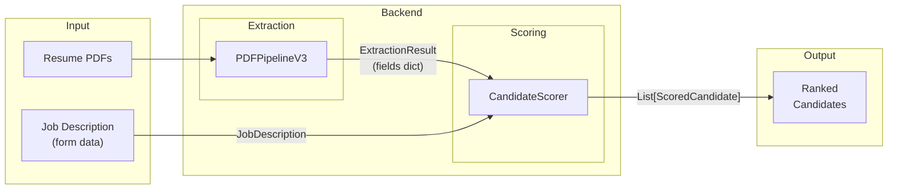
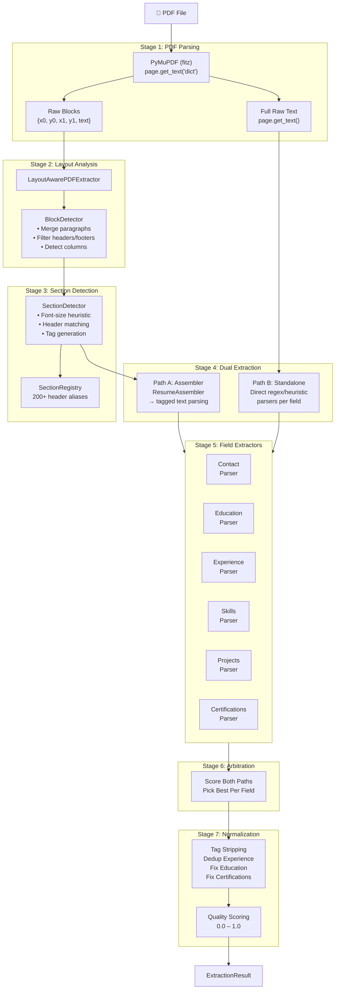
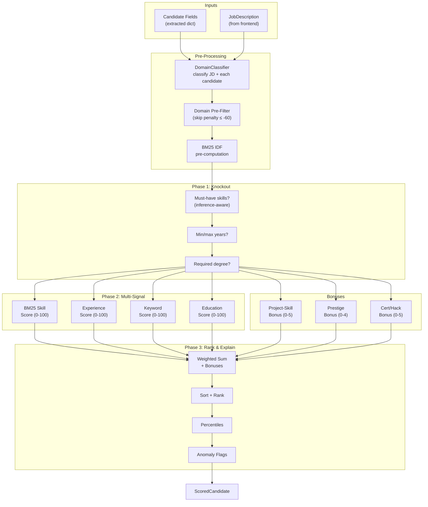
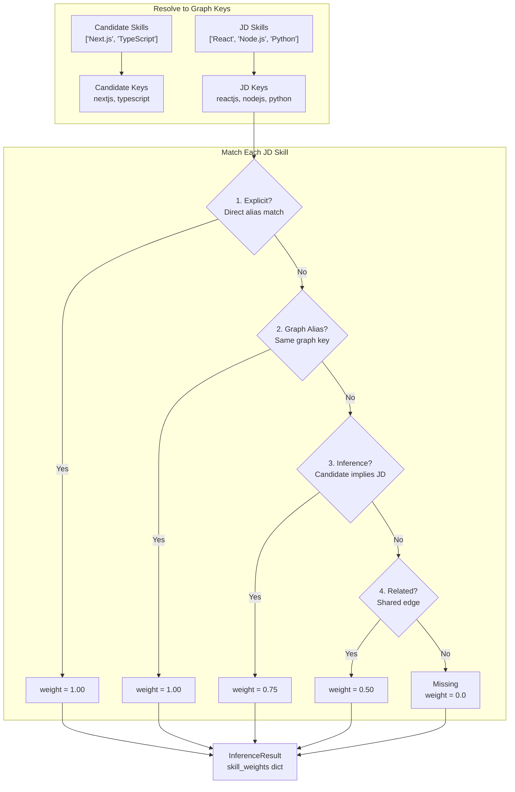
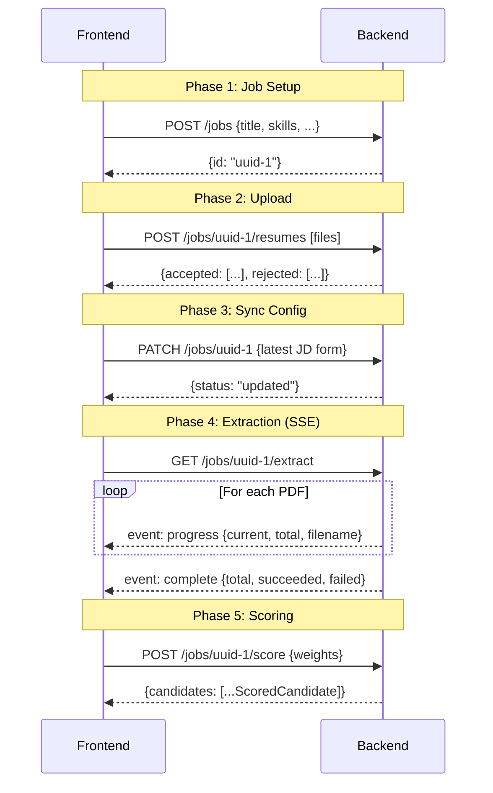
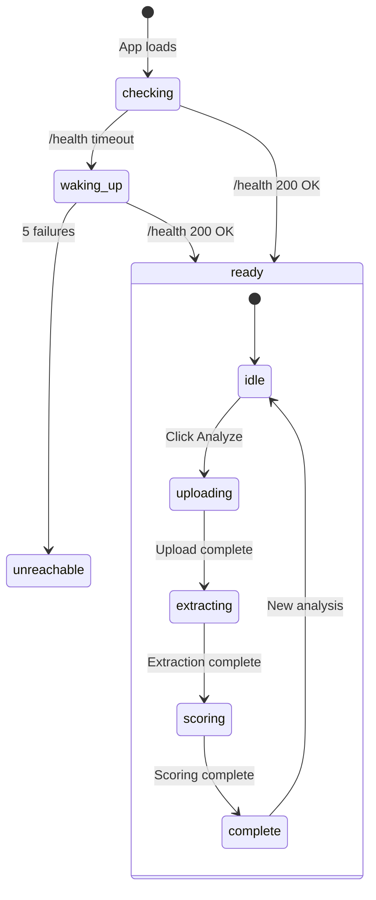

# 12 — Data Flow Diagrams

## Overview

This document provides visual data flow diagrams for every major subsystem, showing how data transforms as it moves through the pipeline.

---

## 1. End-to-End System Flow

---

## 2. PDF Extraction Pipeline (Detailed)

---

## 3. Scoring Pipeline Data Flow

---

## 4. Skill Inference Flow

---

## 5. Frontend-Backend Communication

---

## 6. State Flow in Frontend

