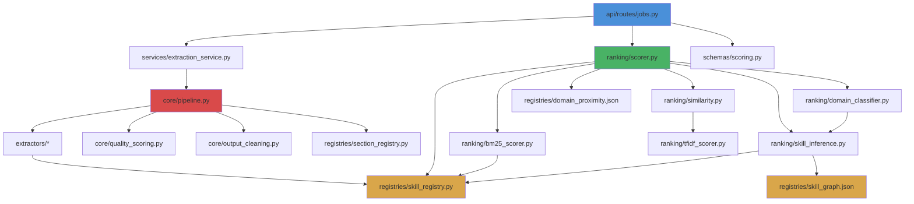

# 13 — File Map & Module Index

## Overview

Complete index of every file in the repository with its purpose, line count, dependencies, and ownership domain.

---

## Backend File Map

### Entry Points

| File | Lines | Purpose |
|------|-------|---------|
| [main.py](file:///home/swyra/Desktop/resume-ranking/backend/main.py) | 46 | CLI entry point — run extraction on a single PDF |
| [src/api/app.py](file:///home/swyra/Desktop/resume-ranking/backend/src/api/app.py) | 40 | FastAPI application factory — CORS, route registration |

### API Layer (`src/api/`)

| File | Lines | Purpose | Key Exports |
|------|-------|---------|-------------|
| [routes/health.py](file:///home/swyra/Desktop/resume-ranking/backend/src/api/routes/health.py) | 17 | `GET /health` endpoint | `router` |
| [routes/jobs.py](file:///home/swyra/Desktop/resume-ranking/backend/src/api/routes/jobs.py) | 440 | Job CRUD, upload, SSE extraction, scoring | `router`, request/response models |
| [routes/__init__.py](file:///home/swyra/Desktop/resume-ranking/backend/src/api/routes/__init__.py) | 1 | Package marker | — |

### Core Pipeline (`src/core/`)

| File | Lines | Purpose | Key Exports |
|------|-------|---------|-------------|
| [pipeline.py](file:///home/swyra/Desktop/resume-ranking/backend/src/core/pipeline.py) | 2,496 | PDFPipelineV3 — orchestrates all extraction | `PDFPipelineV3` |
| [quality_scoring.py](file:///home/swyra/Desktop/resume-ranking/backend/src/core/quality_scoring.py) | 222 | Text/semantic quality assessment functions | `compute_quality`, `compute_text_quality`, `compute_semantic_quality`, `remove_duplicate_blocks` |
| [output_cleaning.py](file:///home/swyra/Desktop/resume-ranking/backend/src/core/output_cleaning.py) | 54 | Tag stripping, text normalization | `strip_tags`, `clean_text_for_ranking`, `recursive_strip` |
| [section_assembly.py](file:///home/swyra/Desktop/resume-ranking/backend/src/core/section_assembly.py) | 22 | ⚠️ Duplicate `SectionContent` dataclass | `SectionContent` |
| [__init__.py](file:///home/swyra/Desktop/resume-ranking/backend/src/core/__init__.py) | ~1 | Package marker | — |

### Extractors (`src/extractors/`)

| Directory | Purpose | Key Parser |
|-----------|---------|------------|
| [contact/](file:///home/swyra/Desktop/resume-ranking/backend/src/extractors/contact) | Name, email, phone, location, LinkedIn | `contact_parser.py` |
| [education/](file:///home/swyra/Desktop/resume-ranking/backend/src/extractors/education) | Degree, institution, year | Education parser |
| [experience/](file:///home/swyra/Desktop/resume-ranking/backend/src/extractors/experience) | Role, company, dates, description, achievements | Experience parser |
| [skills/](file:///home/swyra/Desktop/resume-ranking/backend/src/extractors/skills) | Flat skill list via dictionary matching | Skills parser |
| [projects/](file:///home/swyra/Desktop/resume-ranking/backend/src/extractors/projects) | Project name, description, technologies | Projects parser |
| [certifications/](file:///home/swyra/Desktop/resume-ranking/backend/src/extractors/certifications) | Cert name, issuer, date | Certifications parser |
| [layout/](file:///home/swyra/Desktop/resume-ranking/backend/src/extractors/layout) | LayoutAwarePDFExtractor, BlockDetector, SectionDetector | Layout analysis |

### Ranking Engine (`src/ranking/`)

| File | Lines | Purpose | Key Exports |
|------|-------|---------|-------------|
| [scorer.py](file:///home/swyra/Desktop/resume-ranking/backend/src/ranking/scorer.py) | 1,022 | 3-phase scoring orchestrator | `CandidateScorer`, `print_rankings` |
| [bm25_scorer.py](file:///home/swyra/Desktop/resume-ranking/backend/src/ranking/bm25_scorer.py) | 99 | BM25-inspired skill scoring | `bm25_skill_score`, `precompute_bm25_idf` |
| [tfidf_scorer.py](file:///home/swyra/Desktop/resume-ranking/backend/src/ranking/tfidf_scorer.py) | 45 | TF-IDF tokenization + cosine similarity | `tokenize`, `tf`, `cosine_sim`, `text_cosine_sim` |
| [similarity.py](file:///home/swyra/Desktop/resume-ranking/backend/src/ranking/similarity.py) | 384 | Experience, keyword, education scoring | `experience_score`, `keyword_score`, `education_score`, `parse_date`, `compute_total_experience_years` |
| [skill_inference.py](file:///home/swyra/Desktop/resume-ranking/backend/src/ranking/skill_inference.py) | 313 | Graph-based skill inference engine | `SkillInferenceEngine`, `InferenceResult`, `SkillMatchResult` |
| [domain_classifier.py](file:///home/swyra/Desktop/resume-ranking/backend/src/ranking/domain_classifier.py) | 490 | Professional domain classification (13 domains) | `DomainClassifier` |
| [__init__.py](file:///home/swyra/Desktop/resume-ranking/backend/src/ranking/__init__.py) | ~8 | Re-exports | — |

### Registries (`src/registries/`)

| File | Lines/Size | Purpose | Key Exports |
|------|------------|---------|-------------|
| [skill_registry.py](file:///home/swyra/Desktop/resume-ranking/backend/src/registries/skill_registry.py) | 321 | Skill aliases, normalization, matching | `normalize`, `match`, `find_matches`, `get_search_variants`, `SKILL_ALIASES` |
| [section_registry.py](file:///home/swyra/Desktop/resume-ranking/backend/src/registries/section_registry.py) | 269 | Section header → canonical mapping | `resolve`, `SECTION_ALIASES`, `CANONICAL_SECTIONS` |
| [skill_graph.json](file:///home/swyra/Desktop/resume-ranking/backend/src/registries/skill_graph.json) | ~80KB | Skill implies/related graph | 200+ skill nodes |
| [domain_proximity.json](file:///home/swyra/Desktop/resume-ranking/backend/src/registries/domain_proximity.json) | ~5KB | Cross-domain penalty matrix | Penalties + sub-domain penalties |

### Schemas (`src/schemas/`)

| File | Lines | Purpose | Key Exports |
|------|-------|---------|-------------|
| [scoring.py](file:///home/swyra/Desktop/resume-ranking/backend/src/schemas/scoring.py) | 89 | Scoring data models | `JobDescription`, `ScoredCandidate` |
| [extraction.py](file:///home/swyra/Desktop/resume-ranking/backend/src/schemas/extraction.py) | 36 | Extraction data models | `ExtractionResult`, `SectionContent` |

### Services (`src/services/`)

| File | Lines | Purpose | Status |
|------|-------|---------|--------|
| [extraction_service.py](file:///home/swyra/Desktop/resume-ranking/backend/src/services/extraction_service.py) | 26 | Thin wrapper around `PDFPipelineV3` | ✅ Used by `jobs.py` |
| [ranking_service.py](file:///home/swyra/Desktop/resume-ranking/backend/src/services/ranking_service.py) | 23 | Thin wrapper around `CandidateScorer` | ⚠️ Unused by API routes |
| [document_service.py](file:///home/swyra/Desktop/resume-ranking/backend/src/services/document_service.py) | 46 | End-to-end extract + rank wrapper | ⚠️ Never called |

### Configuration (`src/config/`)

| File | Lines | Purpose |
|------|-------|---------|
| [settings.py](file:///home/swyra/Desktop/resume-ranking/backend/src/config/settings.py) | 34 | Centralized path configuration (PROJECT_ROOT, DATA_DIR, etc.) |

### Scripts (`scripts/`)

| File | Lines | Purpose |
|------|-------|---------|
| [benchmark.py](file:///home/swyra/Desktop/resume-ranking/backend/scripts/benchmark.py) | 67 | Baseline extraction capture for regression testing |

### Tests (`tests/`)

| File/Dir | Lines | Purpose |
|----------|-------|---------|
| [test_domain_guardrails.py](file:///home/swyra/Desktop/resume-ranking/backend/tests/test_domain_guardrails.py) | ~150 | 7 domain classification regression tests |
| [integration/test_scorer.py](file:///home/swyra/Desktop/resume-ranking/backend/tests/integration/test_scorer.py) | ~500 | Scoring engine integration tests |
| [benchmark_v4/](file:///home/swyra/Desktop/resume-ranking/backend/tests/benchmark_v4) | ~77K | Production benchmark (3856 PDFs, 20 JDs) |
| [benchmark_v3/](file:///home/swyra/Desktop/resume-ranking/backend/tests/benchmark_v3) | ~56K | ⚠️ Superseded benchmark |

---

## Frontend File Map

### Application Shell

| File | Size | Purpose |
|------|------|---------|
| [App.tsx](file:///home/swyra/Desktop/resume-ranking/frontend/src/App.tsx) | 881B | Root component — wraps layout with providers |

### Layout Components (`components/layout/`)

| File | Size | Purpose |
|------|------|---------|
| [AppHeader.tsx](file:///home/swyra/Desktop/resume-ranking/frontend/src/components/layout/AppHeader.tsx) | 948B | Top navigation bar |
| [ThreePanelLayout.tsx](file:///home/swyra/Desktop/resume-ranking/frontend/src/components/layout/ThreePanelLayout.tsx) | 1.6KB | 3-panel split view container |
| [BackendHealthGate.tsx](file:///home/swyra/Desktop/resume-ranking/frontend/src/components/layout/BackendHealthGate.tsx) | 2.4KB | Cold-start / connectivity gate |
| [BlockingErrorAlert.tsx](file:///home/swyra/Desktop/resume-ranking/frontend/src/components/layout/BlockingErrorAlert.tsx) | 2.2KB | Full-screen error overlay |
| [UploadProgressBar.tsx](file:///home/swyra/Desktop/resume-ranking/frontend/src/components/layout/UploadProgressBar.tsx) | 1.5KB | Upload progress indicator |
| [ColdStartLoader.tsx](file:///home/swyra/Desktop/resume-ranking/frontend/src/components/layout/ColdStartLoader.tsx) | 1.6KB | Loading animation |

### Job Setup Components (`components/job-setup/`)

| File | Size | Purpose |
|------|------|---------|
| [JobSetupPanel.tsx](file:///home/swyra/Desktop/resume-ranking/frontend/src/components/job-setup/JobSetupPanel.tsx) | 2.7KB | Left panel container |
| [JobInfoSection.tsx](file:///home/swyra/Desktop/resume-ranking/frontend/src/components/job-setup/JobInfoSection.tsx) | 1.5KB | Title + department inputs |
| [JobDescriptionSection.tsx](file:///home/swyra/Desktop/resume-ranking/frontend/src/components/job-setup/JobDescriptionSection.tsx) | 1.2KB | Free-text description |
| [SkillTagsSection.tsx](file:///home/swyra/Desktop/resume-ranking/frontend/src/components/job-setup/SkillTagsSection.tsx) | 2.0KB | Must-have / nice-to-have tags |
| [ExperienceSection.tsx](file:///home/swyra/Desktop/resume-ranking/frontend/src/components/job-setup/ExperienceSection.tsx) | 1.6KB | Min/max years inputs |
| [EducationSection.tsx](file:///home/swyra/Desktop/resume-ranking/frontend/src/components/job-setup/EducationSection.tsx) | 2.6KB | Degree level + field |
| [KeywordsSection.tsx](file:///home/swyra/Desktop/resume-ranking/frontend/src/components/job-setup/KeywordsSection.tsx) | 1.9KB | Keyword tag input |
| [WeightsSection.tsx](file:///home/swyra/Desktop/resume-ranking/frontend/src/components/job-setup/WeightsSection.tsx) | 2.4KB | Scoring weight sliders |
| [AnalyzeButton.tsx](file:///home/swyra/Desktop/resume-ranking/frontend/src/components/job-setup/AnalyzeButton.tsx) | 8.5KB | Full workflow orchestrator |

### Candidate Components (`components/candidates/`)

| File | Size | Purpose |
|------|------|---------|
| [CandidateListPanel.tsx](file:///home/swyra/Desktop/resume-ranking/frontend/src/components/candidates/CandidateListPanel.tsx) | 4.1KB | Center panel — candidate list |
| [CandidateRow.tsx](file:///home/swyra/Desktop/resume-ranking/frontend/src/components/candidates/CandidateRow.tsx) | 3.0KB | Individual candidate row |
| [CandidateFilters.tsx](file:///home/swyra/Desktop/resume-ranking/frontend/src/components/candidates/CandidateFilters.tsx) | 3.3KB | Signal filter + search + sort |
| [CandidateListFooter.tsx](file:///home/swyra/Desktop/resume-ranking/frontend/src/components/candidates/CandidateListFooter.tsx) | 1.4KB | Stats footer |
| [CenterPanelLoader.tsx](file:///home/swyra/Desktop/resume-ranking/frontend/src/components/candidates/CenterPanelLoader.tsx) | 2.6KB | Extraction progress UI |
| [ResumeUploadZone.tsx](file:///home/swyra/Desktop/resume-ranking/frontend/src/components/candidates/ResumeUploadZone.tsx) | 7.7KB | Drag-and-drop upload area |

### Detail Components (`components/detail/`)

| File | Size | Purpose |
|------|------|---------|
| [CandidateDetailPanel.tsx](file:///home/swyra/Desktop/resume-ranking/frontend/src/components/detail/CandidateDetailPanel.tsx) | 2.4KB | Right panel container |
| [CandidateHeader.tsx](file:///home/swyra/Desktop/resume-ranking/frontend/src/components/detail/CandidateHeader.tsx) | 983B | Name + score badge |
| [MatchScoreSection.tsx](file:///home/swyra/Desktop/resume-ranking/frontend/src/components/detail/MatchScoreSection.tsx) | 3.3KB | Score breakdown visualization |
| [SkillBreakdown.tsx](file:///home/swyra/Desktop/resume-ranking/frontend/src/components/detail/SkillBreakdown.tsx) | 2.2KB | Matched/missing/extra skills |
| [KnockoutChecks.tsx](file:///home/swyra/Desktop/resume-ranking/frontend/src/components/detail/KnockoutChecks.tsx) | 1.1KB | Knockout reason display |
| [ExperienceTimeline.tsx](file:///home/swyra/Desktop/resume-ranking/frontend/src/components/detail/ExperienceTimeline.tsx) | 871B | Work history timeline |
| [EducationSection.tsx](file:///home/swyra/Desktop/resume-ranking/frontend/src/components/detail/EducationSection.tsx) | 836B | Education entries |
| [FlagsSection.tsx](file:///home/swyra/Desktop/resume-ranking/frontend/src/components/detail/FlagsSection.tsx) | 809B | Anomaly flags |
| [CandidateActions.tsx](file:///home/swyra/Desktop/resume-ranking/frontend/src/components/detail/CandidateActions.tsx) | 5.4KB | Status/note actions |

### State Management (`store/`)

| File | Size | Purpose |
|------|------|---------|
| [app-store.ts](file:///home/swyra/Desktop/resume-ranking/frontend/src/store/app-store.ts) | 2.1KB | App phase, backend status, upload progress |
| [job-store.ts](file:///home/swyra/Desktop/resume-ranking/frontend/src/store/job-store.ts) | 3.2KB | JD form state + actions |
| [candidate-store.ts](file:///home/swyra/Desktop/resume-ranking/frontend/src/store/candidate-store.ts) | 3.2KB | Candidate data + filtering + selection |
| [types.ts](file:///home/swyra/Desktop/resume-ranking/frontend/src/store/types.ts) | 1.9KB | TypeScript interfaces |

### Hooks & Libraries

| File | Size | Purpose |
|------|------|---------|
| [hooks/useApiCall.ts](file:///home/swyra/Desktop/resume-ranking/frontend/src/hooks/useApiCall.ts) | 4.1KB | API call wrapper with loading/error state |
| [lib/api.ts](file:///home/swyra/Desktop/resume-ranking/frontend/src/lib/api.ts) | 6.4KB | Centralized API client (all backend calls) |
| [lib/mapScoredCandidate.ts](file:///home/swyra/Desktop/resume-ranking/frontend/src/lib/mapScoredCandidate.ts) | 6.4KB | Backend → frontend data transformation |
| [lib/utils.ts](file:///home/swyra/Desktop/resume-ranking/frontend/src/lib/utils.ts) | 166B | Utility functions |

---

## Dependency Graph (Backend)

---

## Lines of Code Summary

| Component | Files | Lines | % of Backend |
|-----------|-------|-------|-------------|
| Core Pipeline | 4 | ~2,794 | 46% |
| Ranking Engine | 6 | ~2,353 | 39% |
| API Layer | 3 | ~497 | 8% |
| Registries | 2 py + 2 json | ~590 + ~85KB | — |
| Schemas | 2 | ~125 | 2% |
| Services | 3 | ~95 | 2% |
| Config | 1 | ~34 | <1% |
| **Total Backend** | **~21** | **~6,000+** | **100%** |
| **Frontend** | **~30** | **~3,000+** | — |
