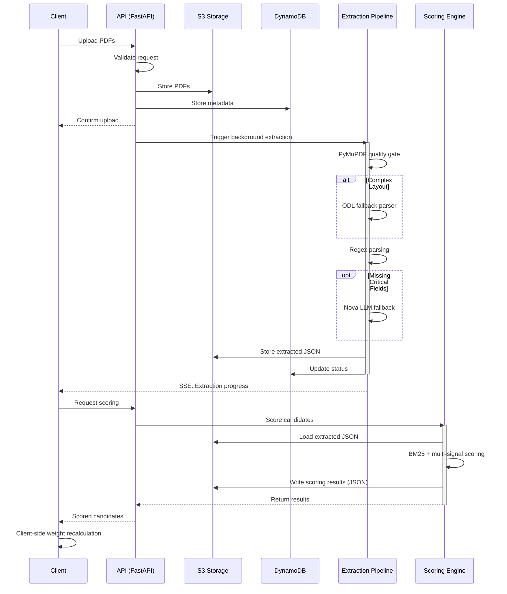

# SWYRA Sortlist v2 — Architecture Specification

> **Note:** This document replaces all previous architecture documents and serves as the authoritative architecture reference for SWYRA Sortlist v2.

## Architecture Pattern

The system follows a **modular monolith** design. There is a single deployable unit per tier.

- **Frontend**: React 18 + TypeScript + Vite + Zustand + shadcn/ui + Tailwind CSS
- **Backend**: Python 3.13 + FastAPI + Uvicorn
- **Database**: DynamoDB single-table design (PAY_PER_REQUEST)
- **Object Storage**: S3 (PDFs, extracted JSON, scoring JSON)
- **Optional**: AWS Lambda via Mangum adapter for serverless deployment

## Module Map

The backend is structured to separate concerns while remaining a single cohesive unit:

```text
backend/src/
├── api/              # FastAPI routes, middleware, dependencies
│   ├── routes/       # jobs_v2.py, health.py (future: auth.py)
│   ├── middleware/   # (future: auth, rate-limit, security headers)
│   └── dependencies/ # (future: get_current_user, get_db)
├── ats/              # ATS scoring service, B2B scorer
├── config/           # Settings, AWS client factory
├── extraction/       # V2 pipeline: structural parsing → ODL → regex → Nova
├── extractors/       # Field parsers: contact, skills, experience, education, projects, layout
├── infrastructure/   # DynamoDB models, repositories, S3 storage, health
├── ranking/          # Scorer, BM25, TF-IDF, skill inference, domain classifier
├── registries/       # Skill registry, section registry, skill graph, domain proximity
├── schemas/          # Pydantic/dataclass DTOs for extraction and scoring
└── services/         # (to be cleaned up)
```

## Data Flow

The system processes resumes through a defined pipeline, separating storage, extraction, and scoring.



## Key Design Decisions

1. **Tiered Extraction**: PyMuPDF fast-path handles clean single-column PDFs. A structural quality gate (x-clustering, reading order, char density) routes complex layouts to the ODL JVM parser. The Nova LLM is strictly used as a fallback to fill missing critical fields only.
2. **Deterministic Scoring**: All scoring is deterministic given the same inputs. BM25 currently uses dynamic pool IDF (with plans to replace with fixed corpus IDF in the future).
3. **SSE for Real-Time**: Server-Sent Events (SSE) are used for broadcasting extraction progress. No WebSockets are used.
4. **DynamoDB Single-Table**: Employs a PK/SK pattern with optimistic concurrency locking for robust data consistency.
5. **Provider Interfaces**: PDF extraction and LLM functionality are encapsulated behind provider interfaces. ODL and Bedrock/Nova are optional adapters toggled via feature flags.

## Optional Adapters (Feature-Flagged)

| Adapter | Purpose | Flag | Default |
|---------|---------|------|---------|
| ODL (JVM) | Multi-column PDF parsing | `ENABLE_ODL` | `false` (degrades gracefully) |
| Bedrock/Nova | LLM field infill | `ENABLE_NOVA` | `false` (degrades gracefully) |

## What Is NOT In This Architecture

- No microservices
- No Kubernetes
- No vector databases or RAG
- No WebSockets
- No agent frameworks
- No new cloud products beyond S3/DynamoDB

## Deployment Modes

1. **Local Dev**: FastAPI + Vite dev server. Uses LocalStack or real AWS for S3/DynamoDB.
2. **Docker**: Backend Dockerfile (Python 3.13-slim + uv), frontend served via Vercel/nginx.
3. **Serverless**: Lambda via Mangum adapter (optional, not the default).
