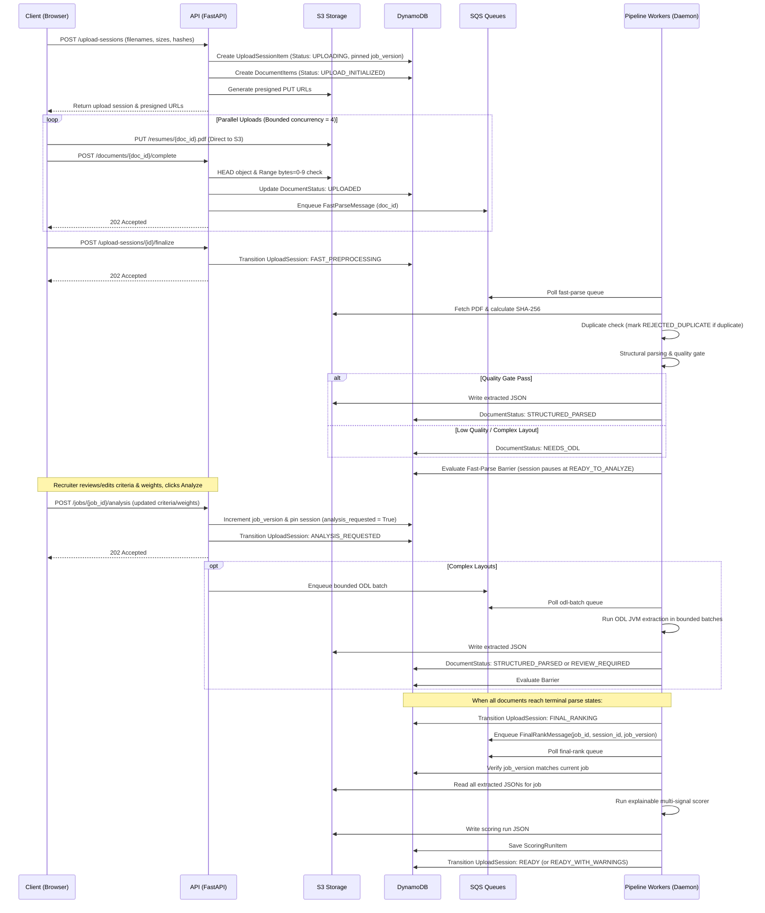

# SWYRA Sortlist v2 — Architecture Specification

> **Note:** This document replaces all previous architecture documents and serves as the authoritative architecture reference for SWYRA Sortlist v2.

## Architecture Pattern

The system follows a **modular monolith** design. There is a single deployable unit per tier.

- **Frontend**: React 18 + TypeScript + Vite + Zustand + shadcn/ui + Tailwind CSS
- **Backend**: Python 3.13 + FastAPI + Uvicorn
- **Database**: DynamoDB single-table design (PAY_PER_REQUEST)
- **Object Storage**: S3 (PDFs, extracted JSON, scoring JSON)
- **Optional**: AWS Lambda via Mangum adapter for serverless deployment

## Module Map

The backend is structured to separate concerns while remaining a single cohesive unit:

```text
backend/src/
├── api/              # FastAPI routes, middleware, dependencies
│   ├── routes/       # jobs_v2.py, health.py (future: auth.py)
│   ├── middleware/   # (future: auth, rate-limit, security headers)
│   └── dependencies/ # (future: get_current_user, get_db)
├── ats/              # ATS scoring service, B2B scorer
├── config/           # Settings, AWS client factory
├── extraction/       # V2 pipeline: structural parsing → ODL → regex → Nova
├── extractors/       # Field parsers: contact, skills, experience, education, projects, layout
├── infrastructure/   # DynamoDB models, repositories, S3 storage, health
│   ├── models/       # job.py, document.py, scoring.py, upload_session.py
│   ├── queue/        # sqs_client.py, queue_models.py (durable SQS abstraction)
│   ├── repositories/ # jobs_repo, docs_repo, upload_sessions_repo
│   └── storage/      # storage_service.py (S3 presigned PUT, CORS, document storage)
├── pipeline/         # Durable stage workers & daemon
│   ├── fast_parse_worker.py  # Stage 1: structural parse & extraction
│   ├── odl_batch_worker.py   # Stage 2: JVM ODL fallback parser
│   ├── final_rank_worker.py  # Stage 3: barrier synchronization & scoring
│   └── worker_daemon.py      # Background worker daemon
├── ranking/          # Scorer, BM25, TF-IDF, skill inference, domain classifier
├── registries/       # Skill registry, section registry, skill graph, domain proximity
├── schemas/          # Pydantic/dataclass DTOs for extraction and scoring
└── services/         # Supporting services
```

## Data Flow

The system processes resumes through a durable, multi-stage pipeline decoupling direct browser uploads, SQS work queues, barrier synchronization, and final ranking.



## Key Design Decisions

1. **Direct Browser-to-S3 Uploads with Presigned PUTs**: Uploads bypass the API server entirely via short-lived, presigned S3 PUT URLs with strict CORS configurations. The API server never buffers 40+ PDFs in memory, eliminating process bottlenecks and 429 rate limit errors.
2. **Lightweight Upload Completion (Decision Record: *"Upload completion is not analysis completion."*)**:
   - `POST /documents/{doc_id}/complete` performs an S3 HEAD check and Range-request (`bytes=0-9`) magic-bytes check, marks `UPLOADED`, enqueues `FAST_PARSE_QUEUE`, and returns HTTP 202 immediately. It never downloads the full PDF or runs PyMuPDF on the HTTP request thread.
   - `POST /upload-sessions/{id}/finalize` transitions the session to `FAST_PREPROCESSING` (HTTP 202). Fast-parse workers process PDFs and pause at `READY_TO_ANALYZE`.
   - The recruiter can review and adjust criteria/weights, then trigger analysis via `POST /api/v2/jobs/{job_id}/analysis`, which sets `analysis_requested = True`, pins `job_version`, and engages ODL fallback and final ranking.
3. **Durable Multi-Stage SQS Pipelines**: Extraction and ranking are decoupled into discrete SQS queues (`fast-parse`, `odl-batch`, `final-rank`, and `dlq`). Failed messages undergo exponential backoff with jitter before routing to the DLQ, ensuring zero data loss.
4. **Barrier Synchronization**: Final ranking is gated by a barrier condition in DynamoDB. Only when all documents in an upload session reach a terminal parse state (`STRUCTURED_PARSED`, `REVIEW_REQUIRED`, `REJECTED_DUPLICATE`, or `FAILED`) and `analysis_requested == True` does the pipeline enqueue the `FinalRankMessage`. Partial failures resolve to `READY_WITH_WARNINGS`.
5. **Job Version Pinning & Stale Rank Rejection**: Upload sessions and ranking messages pin the exact `job_version` active at analysis initiation. If criteria change before ranking begins, stale ranking runs are dropped without overwriting updated criteria.
6. **Stateless Resumability & Worker Daemon Discipline**: Process-local locks (`_extraction_locks`) and FastAPI `BackgroundTasks` have been eliminated. Workers are completely stateless and horizontally scalable. `BackgroundWorkerDaemon` is strictly gated behind `RUN_LOCAL_WORKERS=true` in FastAPI lifespan and is never run by default in production. FastAPI HTTP request handlers never invoke `drain_all_queues_sync()`.
7. **Structured Rate Limiting Diagnostics**: Active session quota breaches return structured 429 JSON payloads (`status_code`, `error_code`, `route`, `job_id`, `session_id`, `org_id`, `client_ip_hash`, `retry_after`) with standard `Retry-After` headers.
8. **Deterministic Scoring**: All scoring is deterministic given the same inputs. BM25 uses dynamic pool IDF. No LLM or non-deterministic component is used in score computation.

## Optional Adapters (Feature-Flagged)

| Adapter | Purpose | Flag | Default |
|---------|---------|------|---------|
| ODL (JVM) | Multi-column PDF parsing | `ENABLE_ODL` | `false` (degrades gracefully) |
| Bedrock/Nova | LLM field infill | `ENABLE_NOVA` | `false` (degrades gracefully) |

## What Is NOT In This Architecture

- No microservices
- No Kubernetes
- No vector databases or RAG
- No WebSockets
- No agent frameworks
- No new cloud products beyond S3, DynamoDB, and SQS

## Deployment Modes

1. **Local Dev**: FastAPI + Vite dev server. Uses LocalStack or real AWS for S3/DynamoDB/SQS with sync queue drain fallbacks.
2. **Docker**: Backend Dockerfile (Python 3.13-slim + uv), frontend served via Vercel/nginx. Worker daemon runs concurrently in the FastAPI lifespan.
3. **Serverless**: Lambda via Mangum adapter (optional, not the default).

