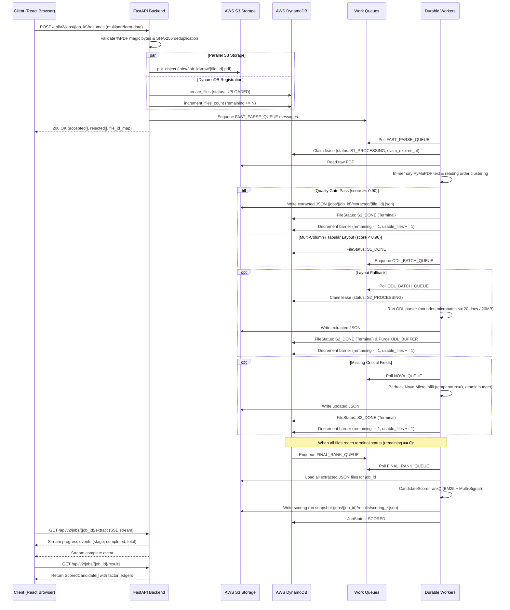

# SWYRA Sortlist v2 — Architecture Specification

> **Note:** This is the authoritative architecture reference for SWYRA Sortlist v2.2. It replaces all prior specifications.

---

## 1. Architecture Pattern: Modular Monolith

SWYRA Sortlist is built as a **modular monolith**: a single deployable unit per tier that achieves high durability, operational simplicity, and sub-millisecond local latency without the distributed failure modes of microservices.

- **Frontend:** React 18 + TypeScript + Vite + Zustand + Tailwind CSS + shadcn/ui
- **Backend:** Python 3.13 + FastAPI + Uvicorn (ASGI)
- **Database:** DynamoDB single-table design (`PAY_PER_REQUEST` billing mode)
- **Object Storage:** AWS S3 (raw resume PDFs, extracted JSON artifacts, scoring run snapshots)
- **Work Queues:** SQS in cloud production; high-throughput in-memory queues in local development
- **Execution Engines:** PyMuPDF C-engine (fast-path), OpenDataLoader PDF JVM (layout microbatch), Bedrock Nova Micro (infill), deterministic Python ranking algorithms

---

## 2. Module Map

```text
backend/src/
├── api/
│   ├── routes/
│   │   ├── jobs_v2.py               # Multipart upload, SSE stream, scoring, audit routes
│   │   └── health.py                # Liveness & readiness probes
│   └── middleware/
│       └── rate_limit.py            # Token bucket & session rate limiting
├── extraction/
│   ├── extraction_pipeline.py       # Multi-stage extraction orchestrator
│   ├── structural_parsing_service.py# PyMuPDF fast-path + reading order clustering
│   ├── markdown_extraction_service.py # Regex field extractors
│   ├── odl_client.py                # ODL JVM client
│   └── fallback/nova_service.py     # Bedrock Nova LLM fallback
├── infrastructure/
│   ├── models/
│   │   ├── job.py                   # JobItem & JobStatus
│   │   ├── document.py              # FileItem & FileStatus
│   │   └── scoring.py               # ScoringRunItem
│   ├── repositories/
│   │   ├── jobs_repository.py       # Job CRUD & atomic barrier counters
│   │   └── files_repository.py      # File items, lease management, outbox reconciliation
│   ├── queue/
│   │   ├── queue_models.py          # QueueMessage schema
│   │   ├── sqs_client.py            # SQS client adapter
│   │   └── in_memory_queue.py       # Local in-memory queue adapter
│   └── storage/
│       └── storage_service.py       # S3 storage service (proxied file storage)
├── pipeline/
│   ├── coordinator.py               # Pipeline state coordinator
│   ├── fast_parse_worker.py         # Stage 1: PyMuPDF worker
│   ├── stage2_worker.py             # Stage 2: ODL microbatch worker & buffer management
│   ├── nova_queue_worker.py         # Stage 3: Nova LLM worker
│   ├── final_rank_worker.py         # Stage 4: ScoringWorker & barrier synchronization
│   └── worker_runner.py             # BackgroundWorkerDaemon for local development
└── ranking/
    ├── scorer.py                    # CandidateScorer (deterministic multi-signal scoring)
    ├── bm25_scorer.py               # BM25 scoring with precomputed IDF
    ├── skill_inference.py           # Skill graph inference
    └── domain_classifier.py         # Domain classification & guardrails
```

---

## 3. End-to-End Pipeline & Data Flow


```mermaid
sequenceDiagram
    participant C as Client (React Browser)
    participant A as FastAPI Backend
    participant S3 as AWS S3 Storage
    participant DB as AWS DynamoDB
    participant Q as Work Queues
    participant W as Durable Workers

    %% 1. Upload via Backend Proxy
    C->>A: POST /api/v2/jobs/{job_id}/resumes (multipart/form-data)
    A->>A: Validate %PDF magic bytes & SHA-256 deduplication
    par Parallel S3 Storage
        A->>S3: put_object (jobs/{job_id}/raw/{file_id}.pdf)
    and DynamoDB Registration
        A->>DB: create_files (status: UPLOADED)
        A->>DB: increment_files_count (remaining += N)
    end
    A->>Q: Enqueue FAST_PARSE_QUEUE messages
    A-->>C: 200 OK (accepted[], rejected[], file_id_map)

    %% 2. Stage 1 Fast-Path Parsing
    W->>Q: Poll FAST_PARSE_QUEUE
    W->>DB: Claim lease (status: S1_PROCESSING, claim_expires_at)
    W->>S3: Read raw PDF
    W->>W: In-memory PyMuPDF text & reading order clustering
    alt Quality Gate Pass (score >= 0.90)
        W->>S3: Write extracted JSON (jobs/{job_id}/extracted/{file_id}.json)
        W->>DB: FileStatus: S2_DONE (Terminal)
        W->>DB: Decrement barrier (remaining -= 1, usable_files += 1)
    else Multi-Column / Tabular Layout (score < 0.90)
        W->>DB: FileStatus: S1_DONE
        W->>Q: Enqueue ODL_BATCH_QUEUE
    end

    %% 3. Stage 2 ODL JVM Microbatching
    opt Layout Fallback
        W->>Q: Poll ODL_BATCH_QUEUE
        W->>DB: Claim lease (status: S2_PROCESSING)
        W->>W: Run ODL parser (bounded microbatch <= 20 docs / 20MB)
        W->>S3: Write extracted JSON
        W->>DB: FileStatus: S2_DONE (Terminal) & Purge ODL_BUFFER#
        W->>DB: Decrement barrier (remaining -= 1, usable_files += 1)
    end

    %% 4. Stage 3 LLM Targeted Infill (if needed)
    opt Missing Critical Fields
        W->>Q: Poll NOVA_QUEUE
        W->>W: Bedrock Nova Micro infill (temperature=0, atomic budget)
        W->>S3: Write updated JSON
        W->>DB: FileStatus: S2_DONE (Terminal)
        W->>DB: Decrement barrier (remaining -= 1, usable_files += 1)
    end

    %% 5. Barrier Synchronization & Final Ranking
    Note over DB,W: When all files reach terminal status (remaining == 0):
    DB->>Q: Enqueue FINAL_RANK_QUEUE
    W->>Q: Poll FINAL_RANK_QUEUE
    W->>S3: Load all extracted JSON files for job_id
    W->>W: CandidateScorer.rank() (BM25 + Multi-Signal)
    W->>S3: Write scoring run snapshot (jobs/{job_id}/results/scoring_*.json)
    W->>DB: JobStatus: SCORED

    %% 6. Live SSE Updates
    C->>A: GET /api/v2/jobs/{job_id}/extract (SSE stream)
    A-->>C: Stream progress events (stage, completed, total)
    A-->>C: Stream complete event
    C->>A: GET /api/v2/jobs/{job_id}/results
    A-->>C: Return ScoredCandidate[] with factor ledgers
```

---

## 4. Key Design Decisions

### 1. Frontend -> Backend -> S3 Upload Proxy
- Resumes are streamed from the client directly to FastAPI multipart endpoints.
- FastAPI validates the initial bytes against `%PDF` magic numbers to stop invalid/corrupt files before they touch storage.
- The server writes the document directly to S3 via `boto3.client('s3').put_object()`.
- **Zero S3 CORS:** Eliminating direct-from-browser S3 PUTs removes the need for S3 CORS configuration, cutting server boot time from 24+ seconds to sub-50ms.

### 2. Durable Queues & Outbox Pattern
- Work across extraction stages is decoupled into discrete queues: `FAST_PARSE_QUEUE`, `ODL_BATCH_QUEUE`, `NOVA_QUEUE`, and `FINAL_RANK_QUEUE`.
- Files are claimed with explicit lease timestamps (`claim_expires_at`).
- If a worker crashes or is forcefully terminated, `reconcile_outbox()` identifies expired leases and re-enqueues stranded items back to their stage queues, guaranteeing 100% crash durability.

### 3. Barrier Synchronization & Self-Healing
- Final scoring is strictly barrier-synchronized: all documents in a job must reach terminal status (`S2_DONE`, `FAILED`, `REJECTED_DUPLICATE`) before scoring initiates.
- If worker crashes or dropped messages leave a job with all files terminal but `remaining > 0`, the outbox reconciler automatically detects the condition, updates `remaining = 0`, syncs `usable_files`, and triggers `ScoringWorker`.

### 4. ODL Buffer Lifecycle Purging
- Documents queued for Stage 2 layout parsing are tracked in DynamoDB under `ODL_BUFFER#`.
- Items are immediately deleted upon reaching terminal status or upon batch completion, preventing queue skip spam and log noise.

### 5. Deterministic Scoring & Non-Negotiable Ethics
- Scoring is 100% deterministic and explainable:
  - Skills match via BM25 with a fixed reference IDF corpus.
  - Experience match via TF-IDF role title cosine similarity + duration math.
  - Keyword and education requirements evaluated with transparent arithmetic.
- **Prohibited Factors:** Prestige company lists, Ivy League university bonuses, career gap penalties, and demographic attributes are strictly deleted and prohibited.
- **Client-Side Weight Recalculation:** Adjusting weights in the recruiter UI re-evaluates candidate rankings instantly in the browser without network latency.

---

## 5. Deployment Modes

1. **Local Development:**
   - FastAPI + Vite dev server running on localhost (`127.0.0.1:8000` / `localhost:5173`).
   - S3 & DynamoDB backed by AWS or LocalStack.
   - High-throughput in-memory queues managed by `BackgroundWorkerDaemon`.
2. **Containerized Modular Monolith:**
   - Backend packaged via `Dockerfile` (Python 3.13-slim + uv).
   - Frontend served via CDN / static web server (Vercel, nginx, or CloudFront/S3).
   - Workers run either as standalone background worker containers or embedded in the FastAPI lifespan daemon.
3. **Serverless (Optional):**
   - FastAPI app deployed to AWS Lambda via the Mangum ASGI adapter, backed by native AWS SQS queues.
