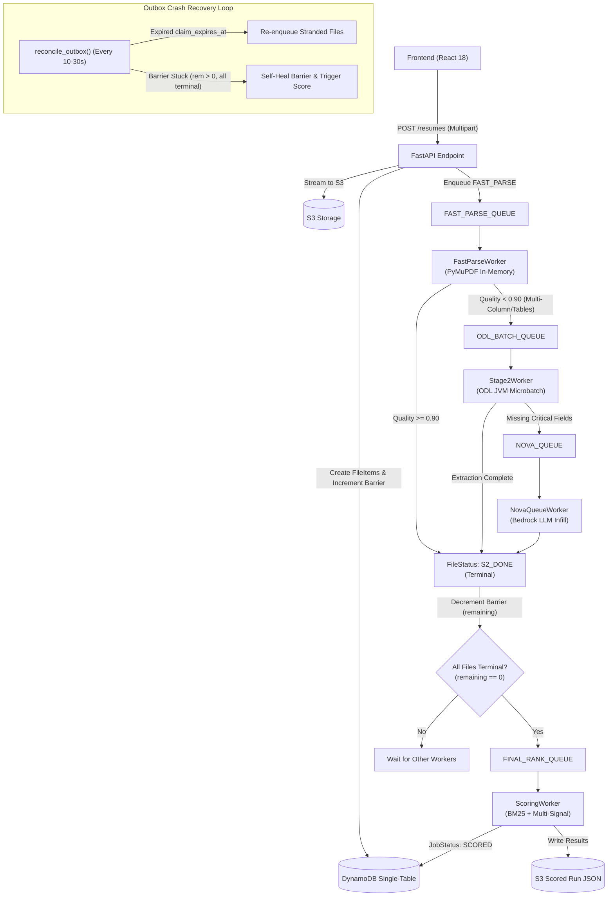

# Mamori: Comprehensive Memory Bridge from V1 to V2.2

This document preserves the institutional memory and architectural evolution of the SWYRA Sortlist codebase, bridging the legacy V1 prototype to the hardened V2.2 modular monolith with durable multi-stage pipeline.

---

## 1. High-Level Architectural Evolution

```
[V1 Prototype]
  Single Monolithic FastAPI Process
  Synchronous PyMuPDF + Regex parsing
  Nested JSON schemas (personal_info)
  Hardcoded Prestige / FAANG Bonuses
  Blocking SSE Polling & Worker Loops
           │
           ▼
[V2 Architecture]
  Modular Monolith with Tiered Extraction (PyMuPDF -> ODL -> Nova)
  Flat JSON schemas (canonical candidate attributes)
  Zero Prohibited Attributes (prestige, gap penalties, hackathons deleted)
  Client-side instant weight recalculation (Zustand)
           │
           ▼
[V2.2 Hardened Production]
  Frontend -> Backend -> S3 Proxied Multipart Uploads (sub-50ms startup)
  Durable Multi-Stage Workers (FastParse, ODL Batch, Nova Queue, Final Rank)
  DynamoDB Outbox Pattern with Worker Lease Recovery (claim_expires_at)
  Barrier Self-Healing (automatic remaining counter synchronization)
  ODL Buffer Lifecycle Purging (zero skip log spam)
  Magic Bytes Validation (%PDF header checks)
  Visible Knockouts by Default (showKnockouts: true)
```

---

## 2. API Endpoints: V1 vs V2.2

| Operation | V1 Prototype (`/jobs`) | V2.2 Production (`/api/v2/jobs`) | Key Architectural Change |
| :--- | :--- | :--- | :--- |
| **Create Job** | `POST /jobs` | `POST /api/v2/jobs` | Added tenant `org_id`, session tracking, versioned criteria (`job_version`), and atomic barrier initialization (`total_files`, `remaining`, `usable_files`). |
| **Update Job** | `PATCH /jobs/{id}` | `PATCH /api/v2/jobs/{id}` | Supports partial criteria updates and increments `job_version` with optimistic concurrency. |
| **Upload Resumes** | `POST /jobs/{id}/resumes` | `POST /api/v2/jobs/{id}/resumes` | **Strict Backend Proxy**: Browser streams multipart PDF to FastAPI. FastAPI verifies `%PDF` magic bytes, writes to S3, updates DynamoDB, increments barrier, and enqueues to `FAST_PARSE_QUEUE`. Direct browser-to-S3 access and S3 CORS eliminated. |
| **Extraction Stream** | `GET /jobs/{id}/extract` | `GET /api/v2/jobs/{id}/extract` | High-efficiency Server-Sent Events (SSE) stream emitting real-time stage progression events (`FAST_PARSE`, `ODL_BATCH`, `NOVA_FALLBACK`, `COMPLETE`). |
| **Scoring / Analysis**| `POST /jobs/{id}/score` | `POST /api/v2/jobs/{id}/analyze`<br/>or `POST /api/v2/jobs/{id}/score` | Atomic analysis trigger. Pins `job_version`, engages barrier synchronization, runs deterministic multi-signal scoring, and persists snapshots to S3. |
| **Fetch Results** | `GET /jobs/{id}/results` | `GET /api/v2/jobs/{id}/results` | Retrieves scoring snapshots with complete factor ledgers, evidence provenance, and knockout flags. |
| **Download PDF** | `GET /jobs/{id}/resumes/{doc_id}/download` | `GET /api/v2/jobs/{id}/resumes/{doc_id}/download` | Streams raw resume PDF securely from S3 with tenant ownership verification. |
| **Audit Log** | *None* | `GET /api/v2/jobs/{id}/audit` | Immutable audit trail tracking job creation, uploads, parsing stages, scoring runs, and human decisions. |
| **ATS Health Check** | *None* | `POST /api/v2/ats-check` | Standalone ephemeral diagnostic tool assessing parseability, layout risks, and contact extraction. Uploaded files purged after processing. |

---

## 3. Data Schema Evolution (V1 Nested vs V2.2 Flat)

In V1, candidate data was deeply nested under `personal_info`. If any parser component failed or shifted fields, names and emails became `"Unknown"`. V2.2 standardized on a **flat canonical model**:

### V1 Schema (Legacy)
```json
{
  "personal_info": {
    "name": "Jane Doe",
    "email": "jane@example.com",
    "phone": "+1-555-0199"
  },
  "skills": ["Python", "FastAPI"],
  "experience": [...]
}
```

### V2.2 Schema (Canonical)
```json
{
  "candidate_id": "c4b9d102-...",
  "document_id": "d7a1e204-...",
  "name": "Jane Doe",
  "email": "jane@example.com",
  "phone": "+1-555-0199",
  "location": "San Francisco, CA",
  "skills": ["Python", "FastAPI", "PostgreSQL"],
  "experience": [
    {
      "title": "Senior Backend Engineer",
      "company": "Tech Corp",
      "start_date": "2021-01",
      "end_date": "2024-05",
      "duration_years": 3.4,
      "description": "Led API modernization..."
    }
  ],
  "education": [
    {
      "degree_level": "Bachelors",
      "degree_name": "B.S. Computer Science",
      "institution": "State University",
      "graduation_year": 2020
    }
  ],
  "extraction_quality": 0.94,
  "identity_confidence": 0.98,
  "stage_timing": {
    "stage1_ms": 142.5,
    "total_ms": 142.5
  }
}
```

---

## 4. Pipeline & Extraction Flow Evolution

### V1 Flow: Synchronous & Monolithic
1. Frontend connected to `GET /jobs/{id}/extract`.
2. Backend downloaded all PDFs sequentially to temporary files.
3. Invoked `PDFPipelineV3` inside `asyncio.to_thread()`.
4. If any file crashed or layout was multi-column, parsing scrambled reading order and failed silently.
5. All state held in memory; server crash caused total data loss.

### V2.2 Flow: Durable Multi-Stage Workers with Outbox Pattern


---

## 5. Scoring Policy & Ethics Transformation

| Scoring Dimension | V1 Prototype (Flawed) | V2.2 Production (Ethical & Transparent) |
| :--- | :--- | :--- |
| **University Prestige** | Hardcoded point bonuses for Ivy League / elite schools. | **COMPLETELY DELETED.** All accredited institutions are evaluated equally based on required degree level. |
| **Employer Prestige** | `_prestige_bonus()` awarded points for FAANG and Fortune 500 companies. | **COMPLETELY DELETED.** Past employers evaluated equally; candidates evaluated solely on role relevance. |
| **Employment Gaps** | Penalized candidates with career gaps via anomaly detection. | **COMPLETELY DELETED.** Gaps in employment are not penalized or scored. |
| **Hackathons / Awards** | Arbitrary bonuses for contest wins. | **REMOVED** unless explicitly specified in JD criteria. |
| **BM25 IDF Corpus** | Dynamic IDF computed from current batch (scores shifted if a new resume was added). | **Fixed Reference IDF Table.** Deterministic scores invariant to batch composition. |
| **Knockout Handling** | Knocked-out candidates were hidden or discarded. | **Preserved & Explained.** Marked with `signal: 'knockout'` and shown with explicit reasons (`showKnockouts: true`). |
| **Weight Adjustments** | Required backend network round-trip. | **Zero Network Latency.** Recomputed in-memory in the frontend using memoized selectors. |

---

## 6. Critical Technical Truths for Maintainers

1. **Direct-to-S3 Presigned Upload Sessions**: The default high-throughput path uses presigned PUT instructions generated by `POST /{job_id}/upload-sessions`. Document metadata is registered in DynamoDB *before* signed URLs are issued. Upload completion (`POST .../documents/{id}/complete`) validates the S3 object presence via lightweight magic-byte Range header checks (`bytes=0-9`) without buffering PDF bodies in API memory.
2. **Three Canonical Queues**: Architecture uses `STAGE1_INGESTION_QUEUE`, `STAGE2_FALLBACK_QUEUE`, and `SCORING_QUEUE`. `STAGE2_FALLBACK_QUEUE` owns both ODL microbatching and Bedrock Nova infill, dispatching based on message stage.
3. **PyMuPDF Execution Must Be Process-Isolated**: Never use multithreaded `ThreadPoolExecutor` or `asyncio.to_thread` with Fitz. Fitz must run in separate child worker processes via `concurrent.futures.ProcessPoolExecutor` to protect C-level memory.
4. **Worker Leases Guarantee Durability**: Worker tasks run with `claim_expires_at` timestamps. If a worker process is interrupted, `reconcile_outbox()` restores the files to their respective queues automatically.
5. **Barrier Invariants**: A job transitions to `SCORED` if and only if all files have reached terminal states (`STRUCTURED_PARSED`, `REVIEW_REQUIRED`, `S2_DONE`, `FAILED`, `REJECTED_DUPLICATE`). The outbox self-healing logic ensures that mismatched barrier counters never cause a permanent hang.
6. **Zustand Selectors Must Be Pure**: Never return newly constructed objects directly from Zustand selectors. Use primitive selectors and compute derived state inside React components via `useMemo`.

---

## 7. Current Verification Evidence (V2.2)

- **Backend Test Suite:** 117 tests passing (100% pass rate).
  - 90/90 Unit tests passing in 90 seconds.
  - 19/19 Integration tests passing in 151 seconds.
  - 8/8 Durable pipeline scenario tests passing in `test_durable_pipeline.py`.
- **Frontend Build:** `tsc -b && vite build` cleanly compiles in 810ms with 0 errors.